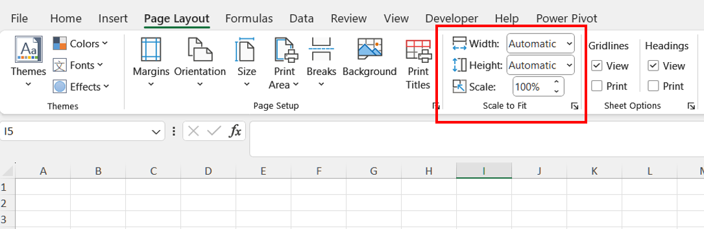
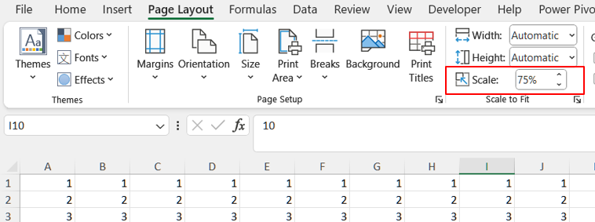

## **Possible Usage Scenarios**
Scaling a worksheet can be useful for various reasons, depending on the context in which you are working. Here are a few common reasons for scaling a worksheet:
1. **Fit to Page**: To ensure that all content fits on a single page or specific number of pages when printing.
1. **Presentation**: To create organized and professional-looking worksheets for sharing.
1. **Readability**: To adjust text and element sizes for better visual accessibility.
1. **Space Management**: To optimize worksheet layout and minimize unnecessary white space.
1. **Data Visualization**: To properly size charts and graphs within available space.
1. **Consistency**: To maintain uniform appearance across multiple worksheets or documents.

## **How to Scale a Worksheet in Excel**
Scaling a worksheet in Excel helps fit content onto specified pages when printing. Follow these steps:

1. Open your worksheet in Excel
1. Navigate to **Page Layout** > **Scale to Fit** group
1. Adjust **Width** and **Height** for page count requirements
1. Set custom scaling percentage if needed
<br>


## **How to Scale a Worksheet Using Python.NET**
Aspose.Cells for Python.NET provides comprehensive worksheet scaling capabilities. Use these approaches to scale worksheets programmatically:

### **Fit to Page Example**
Adjust print settings to fit content on specified pages:
```python
from aspose.cells import Workbook

# Load the Excel file
workbook = Workbook("sample.xlsx")

# Access the first worksheet
sheet = workbook.worksheets[0]

# Access the PageSetup object
page_setup = sheet.page_setup

# Set the worksheet to fit to 1 page wide and 1 page tall
page_setup.fit_to_pages_wide = 1
page_setup.fit_to_pages_tall = 1

# Save the modified workbook
workbook.save("output_fit_to_page.xlsx")
```
<br>


### **Scale to Percentage Example**
Apply custom scaling percentage to worksheet contents:
```python
from aspose.cells import Workbook

# Load the Excel file
workbook = Workbook("sample.xlsx")

# Access the first worksheet
sheet = workbook.worksheets[0]

# Access the PageSetup object
page_setup = sheet.page_setup

# Set the scaling to a specific percentage (e.g., 75%)
page_setup.zoom = 75

# Save the modified workbook
workbook.save("output_scaled_percentage.xlsx")
```
<br>


**Key API References:**
- [**Workbook**](https://reference.aspose.com/cells/python-net/aspose.cells/workbook/) class
- [**Worksheet**](https://reference.aspose.com/cells/python-net/aspose.cells/worksheet/) class
- [**PageSetup**](https://reference.aspose.com/cells/python-net/aspose.cells/pagesetup/) configuration
