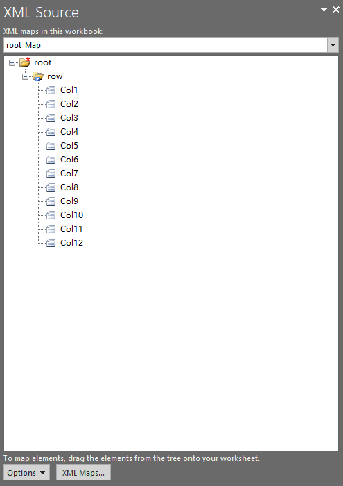

## **Possible Usage Scenarios**

Aspose.Cells for Python via .NET provides [**XmlMapCollection.add()**](https://reference.aspose.com/cells/python-net/aspose.cells/xmlmapcollection/add/#str) method which you can use to import your XML map into the workbook.

## **Add XML Map inside the Workbook using the XmlMapCollection.Add method**

The following sample code adds an XML Map inside the workbook using the [**XmlMapCollection.add()**](https://reference.aspose.com/cells/python-net/aspose.cells/xmlmapcollection/add/#str) method and saves it as an output Excel file ([output excel file](5115434.xlsx)). The screenshot shows the XML Map that has been imported from the [sample.xml](5115433.xml) into the output Excel file.




