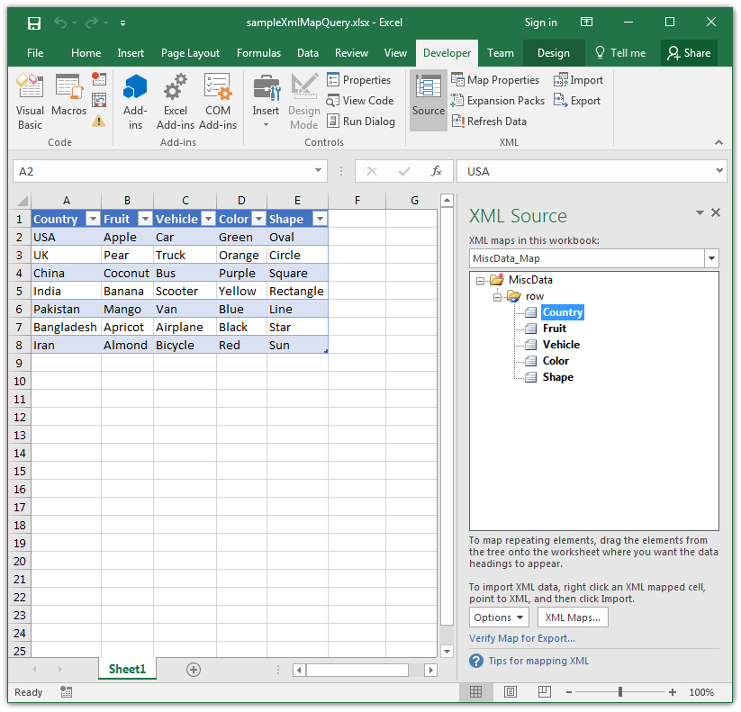

## **Possible Usage Scenarios**

You can query cell areas mapped to the XML map path with Aspose.Cells for Python via .NET using the **[Worksheet.xml_map_query()](https://reference.aspose.com/cells/python-net/aspose.cells/worksheet/xml_map_query)** method. If the path exists, it will return the list of cell areas related to that path inside the XML map. The first parameter of the **[Worksheet.xml_map_query()](https://reference.aspose.com/cells/python-net/aspose.cells/worksheet/xml_map_query)** method specifies the XML element path, and the second parameter specifies an XML map you want to query.

## **Query Cell Areas Mapped to XML Map Path using Worksheet.XmlMapQuery method**

The following screenshot shows Microsoft Excel displaying the XML Map inside the [sample Excel file](55541790.xlsx) used in the code. The code queries the XML map two times and prints the list of cell areas returned by the **[Worksheet.xml_map_query()](https://reference.aspose.com/cells/python-net/aspose.cells/worksheet/xml_map_query)** method on the console as shown below.

### **Sample Code**



### **Console Output**


Query XML Map from Path - /MiscData
Aspose.Cells.CellArea(A1:A8)[0,0,7,0]
Aspose.Cells.CellArea(B1:B8)[0,1,7,1]
Aspose.Cells.CellArea(C1:C8)[0,2,7,2]
Aspose.Cells.CellArea(D1:D8)[0,3,7,3]
Aspose.Cells.CellArea(E1:E8)[0,4,7,4]

Query XML Map from Path - /MiscData/row/Color
Aspose.Cells.CellArea(D1:D8)[0,3,7,3]


## **Get XML Path from List Object/Table**

XML data can be imported to worksheets. Sometimes an XML path is required from the ListObjects of the worksheet. This feature is available in Excel by using an expression like `Sheet1.ListObjects(1).XmlMap.DataBinding`. The same feature is available in Aspose.Cells for Python via .NET by calling **[ListObject.xml_map.data_binding.url](https://reference.aspose.com/cells/python-net/aspose.cells/xmldatabinding/url)**. The following example demonstrates this feature. Template files and other source files can be downloaded from the following links:

1. [XML Data.xlsx](72417285.xlsx)  
2. [Country List.xml](72417287.xml)  
3. [Food List.xml](72417286.xml)




