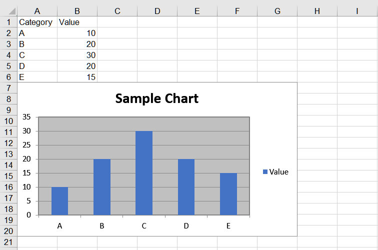

## **Possible Usage Scenarios**
When you need to compare which product is best for your solution, there are many criteria to evaluate, but the main focus will often be the functionality and effort required to use the product. If you are looking for a faster, simpler, and lighter file‑format library to process files, then you might want to compare Aspose.Cells for Python via NET and other Excel Python libraries. You will notice that, in fact, these products do not compete but solve slightly different user tasks.  
By comparing the three leading Python libraries (**pandas**, **xlwings**, and **Aspose.Cells for Python via NET**) for reading data from an Excel file, writing data to an Excel file, and adding a chart to an Excel file, you can discover the ease of use, high performance, and other unique advantages of the **Aspose.Cells for Python via NET** library.  
<ul>
<li><a href="#read-data-from-excel-file">Read data from Excel file using xlwings, pandas and Aspose.Cells python excel library</a></li>
<li><a href="#write-data-to-excel-file">Write data to Excel file using xlwings, pandas and Aspose.Cells python excel library</a></li>
<li><a href="#add-chart-to-excel-file">Add chart to Excel file using xlwings, pandas and Aspose.Cells python excel library</a></li>
</ul>

## **Comparison of Multiple Excel Libraries in Python**
Let's first take a look at the comparison of ten libraries in Python that can operate on Excel files.  
 
<image src="pythonlibs.png" width="70%" />

## **Why Aspose.Cells for Python via NET**
Aspose.Cells for Python is a powerful, easy‑to‑use, efficient, and secure library for all kinds of scenarios where you need to work with Excel files. There are many reasons to use Aspose.Cells for Python, including but not limited to the following points:

### Full featured
Aspose.Cells is a powerful library that provides a wide range of capabilities to handle Excel files, including reading, writing, editing, formatting, computing, and more.

### Ease of use
Aspose.Cells' API is designed to be intuitive and easy to use, enabling Python developers to easily integrate Excel functionality into their applications.

### Cross‑platform support
Aspose.Cells supports a variety of operating systems, including Windows, Linux, and macOS, thus ensuring stable operation in a variety of environments.

### High performance
Aspose.Cells performs well when handling large Excel files and is able to load and save data quickly, thereby improving the performance of your application.

### Security
Aspose.Cells provides data protection and encryption to ensure the security of Excel files against unauthorized access and modification.

### Multiple file formats
Aspose.Cells supports a variety of Excel file formats, including XLS, XLSX, CSV, ODS, etc., for easy interaction with data from different sources.

### Good technical support
Aspose.Cells provides comprehensive documentation and sample code to help developers get started quickly. At the same time, we also provide professional technical support to solve the problems encountered in the process of use.

## **The advantages of Aspose.Cells for Python via NET**
Aspose.Cells for Python is a fully functional, easy‑to‑use, high‑performance, secure, reliable, flexible, and highly integrated library. Whether working with small or large Excel files, data analysis, report generation, or other Excel operations, Aspose.Cells provides developers with an efficient and convenient solution. Aspose.Cells for Python has the following advantages:

### Flexible APIs
Aspose.Cells' API offers a wealth of features that can be customized and extended to suit different needs. This allows developers to easily implement their own business requirements without relying on other tools or libraries.

### Support for multiple programming languages
In addition to Python, Aspose.Cells also supports Java, C#, C++ and other programming languages. This means that developers can choose the most suitable language to implement Excel features based on their preferences and skills.

### Highly integrated
Aspose.Cells can be easily integrated with other Python libraries and frameworks, such as Django, Flask, etc. This allows developers to seamlessly incorporate Excel functionality into their web or desktop applications, increasing the utility and convenience of their solutions.

## **Read data from Excel File**
Let's start with practical applications and compare the three leading Python libraries (**pandas**, **xlwings**, and **Aspose.Cells for Python via NET**) for reading data from the [sample file](sample_data.xlsx).

### Read data from Excel File Using Aspose.Cells for Python via NET


### Read data from Excel File Using xlwings


### Read data from Excel File Using pandas


## **Write data to Excel File**
Let's start with practical applications and compare the three leading Python libraries (**pandas**, **xlwings**, and **Aspose.Cells for Python via NET**) for writing data to an Excel file.

### Write data to Excel File Using Aspose.Cells for Python via NET


### Write data to Excel File Using xlwings


### Write data to Excel File Using pandas


## **Add chart to Excel File**
Let's start with practical applications and compare the three leading Python libraries (**pandas**, **xlwings**, and **Aspose.Cells for Python via NET**) for adding a chart to an Excel file.  
 

### Add chart to Excel File Using Aspose.Cells for Python via NET


### Add chart to Excel File Using xlwings


### Add chart to Excel File Using pandas
In Pandas, you can use the `ExcelWriter` object and the `to_excel()` function to write data to an Excel file. However, please note that Pandas itself does not support embedding charts directly into Excel files; it can only write data. To add a chart, you need to use the `openpyxl` or `xlsxwriter` library to manipulate the workbook. Here is an example of using the `xlsxwriter` library to add a chart to an Excel file.  
 


