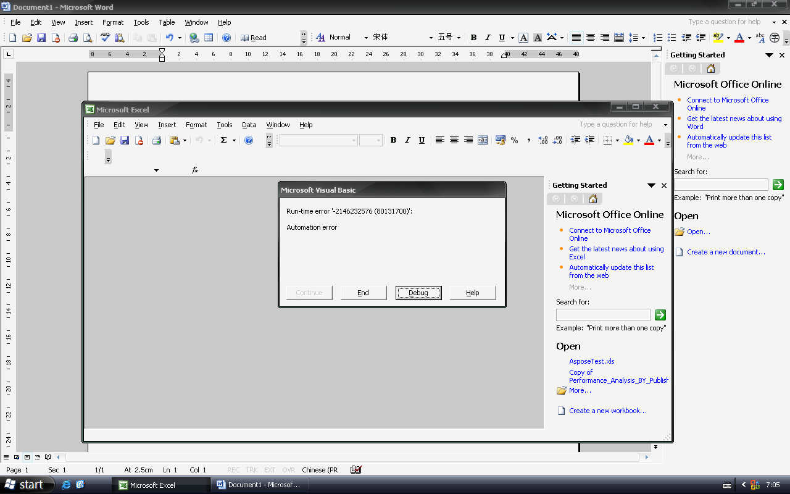

##### **Description**
When Microsoft Excel 2003 loads Aspose.Cells.ReportingServices.Client add-ins, Microsoft Excel produces an automation error: 

##### **Solution**
{} 

- Update to Office 2003 (KB907417)
- Update to Office 2003 SP1

{}
