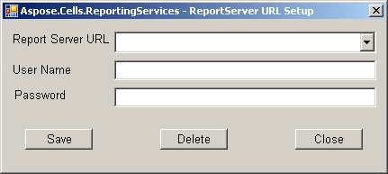

To configure a client Report Server URL:

1. Click the **Open Remote Report** button and get the **Retrieve Report** dialog box. 

   

2. Click the **Config** button and get the **Report Server URL Setup** dialog. 

   

3. Input report server configuration information (URL, user name, and password).
   1. The Report Server URL must be in the format `http://host/ReportServer`. For example: `http://172.16.204.11/ReportServer`.
   2. The user name is the Windows Server user name. For example: **Administrator**.
   3. The password is the Windows Server user password. For example: **123456**.
   4. The default value of the Domain is null.
4. Click the **Test** button to check the configuration information.
5. Click **Save** to save the report server configuration information.

   

6. Click the **Modify** button to modify the configuration information.
