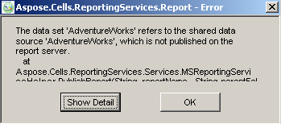
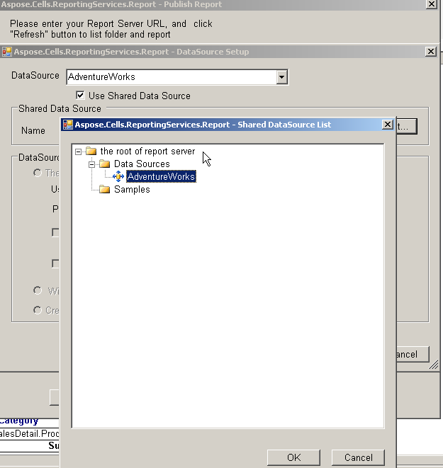

##### **Description**
When publishing a report, the Aspose.Cells.ReportingServices client generates an error: 

##### **Solution**
{} 

1. Click **Data Source Setup**.  
1. Select **Share data source**.  
1. Re‑publish the report.  

{}
