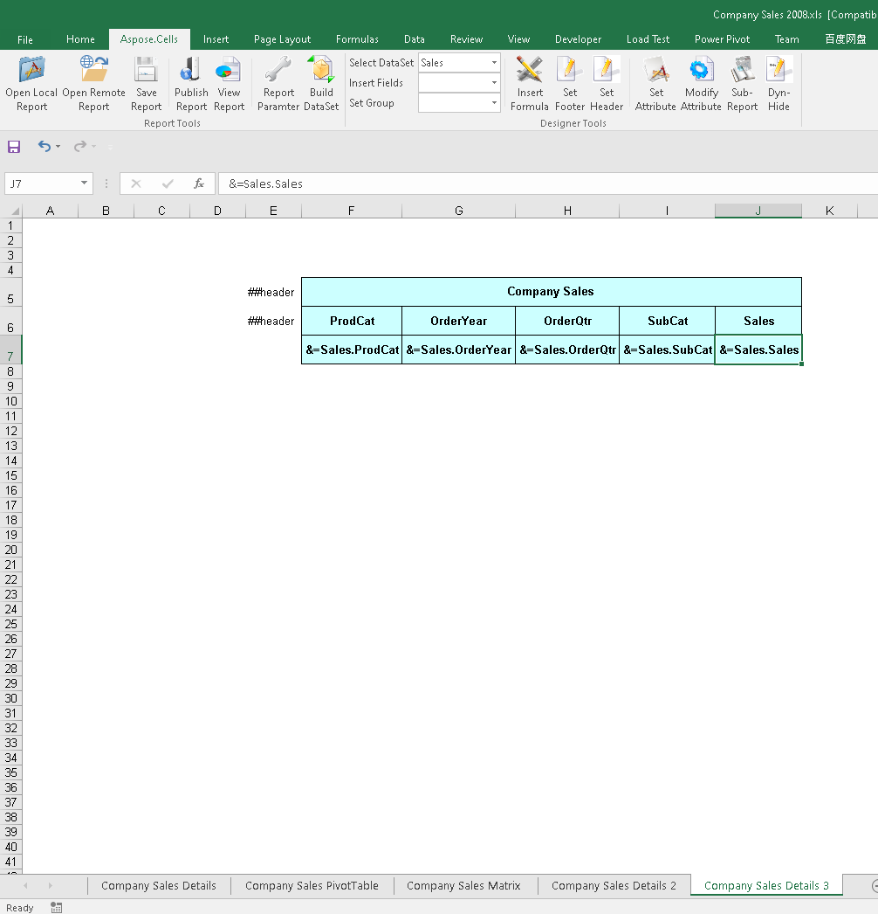
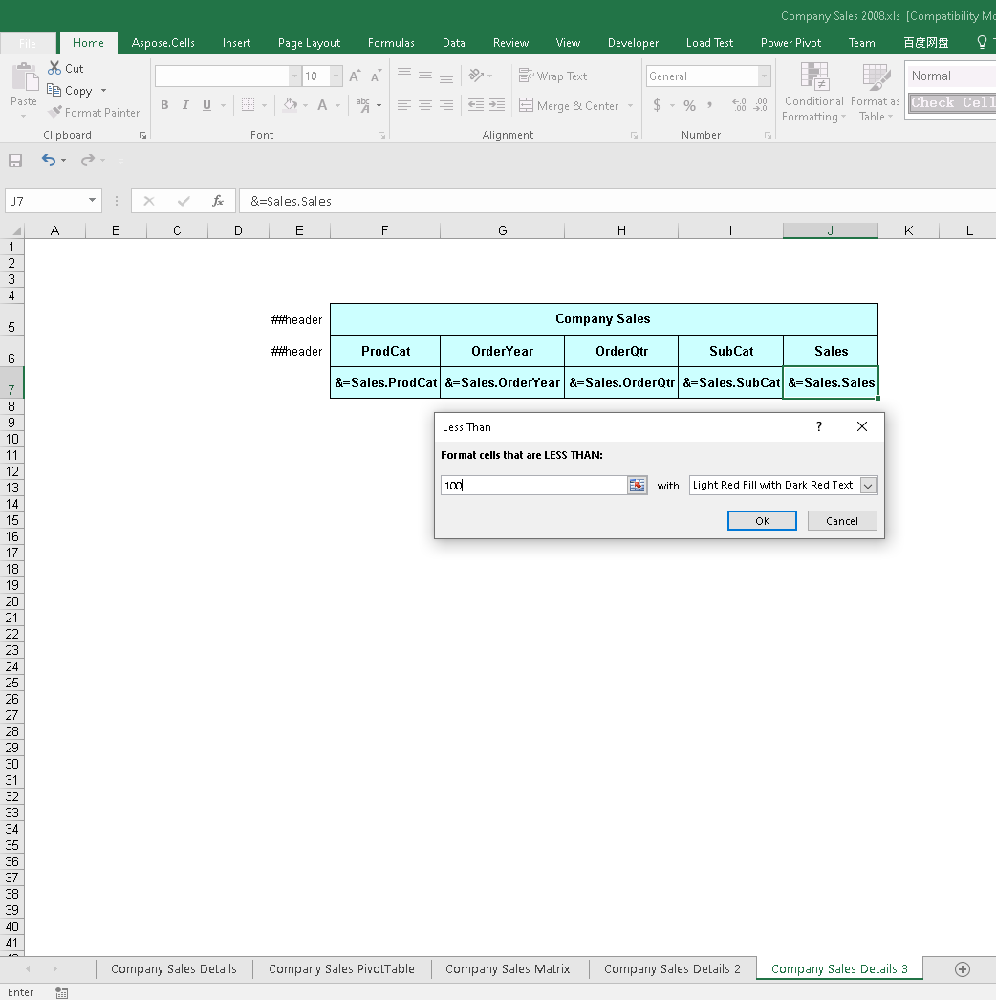
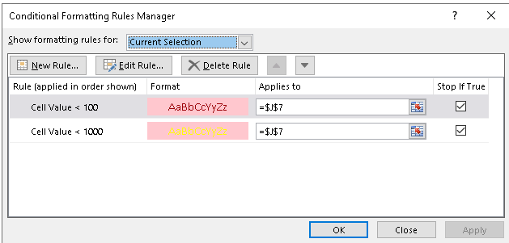
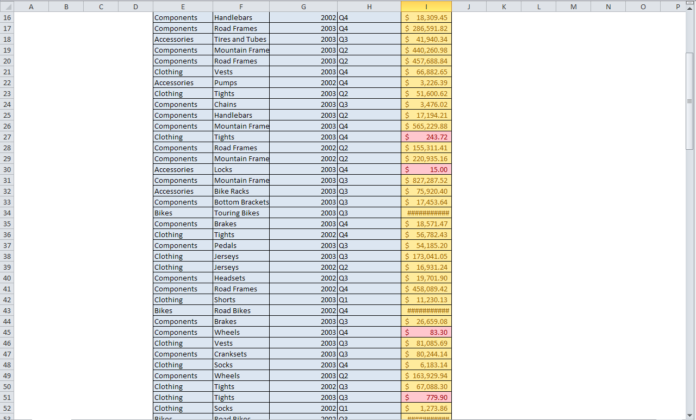
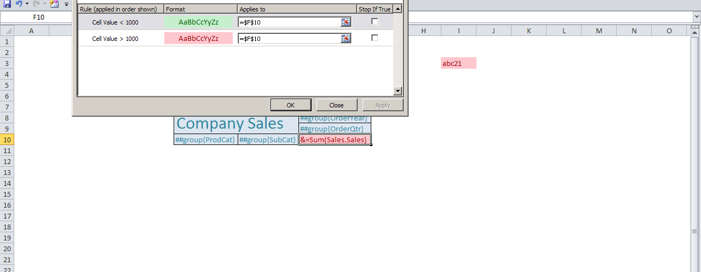
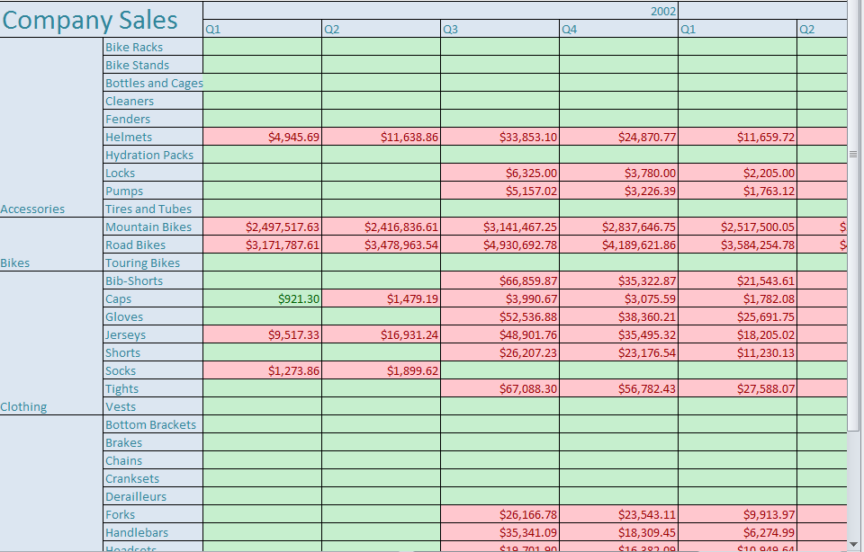

To set conditional formatting for report items:

1. Create and open a report definition file in Microsoft Excel.  
   For the purposes of this article, we'll use the test case (Company Sales 2008.rdl).  
2. Select the Sales List worksheet.  

3. Select cell I6 and add conditional formatting to this cell for the table report item.  
   1. Format cells that are less than 1000 with light red fill and dark red text.  
   2. Format cells that are greater than 1000 with light yellow fill and dark yellow text.  
4. Set additional conditional formatting for a cell.  

5. Save, publish, and review the report.  

6. Add conditional formatting for this cell for a matrix report item or a textbox report item.  

7. Save, publish, and review the report.  

