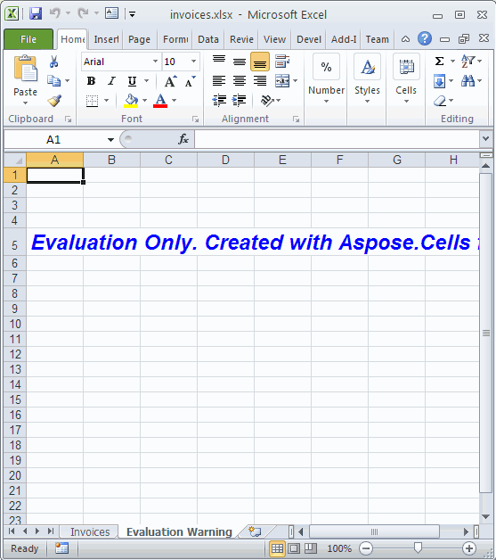

{}

You can easily download Aspose.Cells for Reporting Services for evaluation from the [download page](https://downloads.aspose.com/cells/reportingservices). The evaluation download is **the same** as the purchased download. The evaluation version simply becomes licensed after [applying a license](/cells/reportingservices/licensing/).

{}

The evaluation version of Aspose.Cells for Reporting Services (without a license specified) provides product functionality to some extent, but it is not complete. One limitation is that it always injects an extra worksheet with an evaluation watermark when opening or saving any spreadsheet document.

**Figure:** Demo Spreadsheet created by Aspose.Cells component

It will inject an extra evaluation watermark worksheet to the workbook.

**Figure:** Evaluation Warning – An Extra Worksheet

If you want to test Aspose.Cells for Reporting Services without evaluation version limitations, you may [request a 30‑day temporary license](https://purchase.aspose.com/temporary-license).
