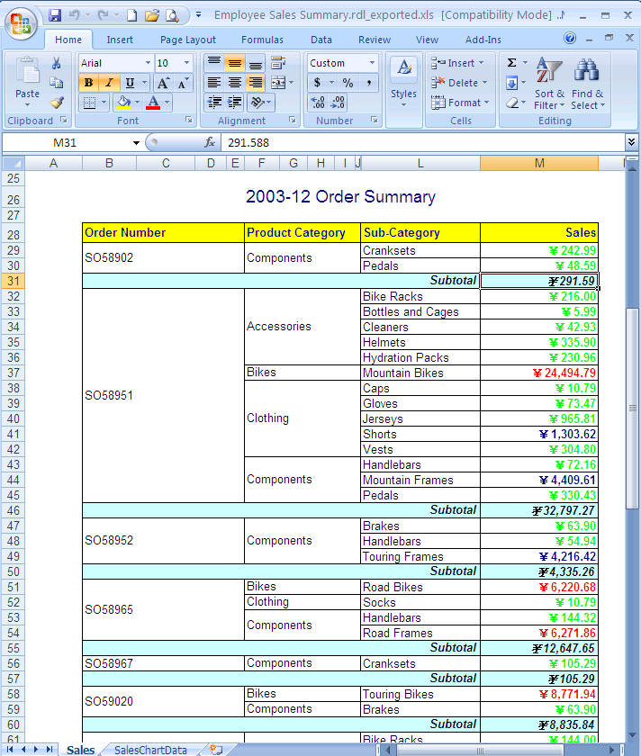

{} 

There are two types of formulas: 

1. Reporting Services formulas and
1. the Microsoft Excel dynamic formula provided by Aspose.Cells for Reporting services.

Using Reporting Services formulas in Aspose.Cells.Report.Designer is the same as applying formulas in Visual Studio. You can set Reporting Services formulas based on the values of cells in a report template. The formulas is calculated and the calculation results are filled back to the cells at rendering time.

Microsoft Excel dynamic formulas are not calculated but converted to a real Microsoft Excel formulas following certain rules and regulations before being filled back to the cells at rendering time.

{} 
- **Formula Output**
**A sample report containing formulas (calculated) is exported using Aspose.Cells for Reporting Services** 

