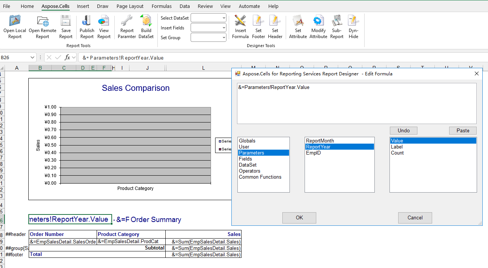

## **Two types of formulas are supported**

1. **Reporting Services formulas** – evaluated by Aspose.Cells at render time.  
2. **Microsoft Excel dynamic formulas** – transformed into native Excel formulas before being written to the workbook.

Both can be used directly in **Aspose.Cells.Report.Designer** just like you would in Visual Studio. The key difference is when the calculation happens:

| Formula Type                | When is it evaluated? | What is stored in the workbook? |
|-----------------------------|-----------------------|---------------------------------|
| **Reporting Services**      | At rendering time (server‑side) | The **calculated value** is written back to the cell. |
| **Excel dynamic formula**   | During export – the expression is converted to a real Excel formula | The **Excel formula** (e.g., `=SUM(A1:A5)`) is stored, allowing end‑users to edit/re‑calculate in Excel. |

## 📊 Sample Report with Calculated Formulas

The screenshot below shows a report that contains **Reporting Services formulas**. When the report is rendered, the formulas are executed and the results are placed into the corresponding cells.

*(If you open the exported workbook in Excel you will see the static values, not the underlying formulas.)*

## 🛠 How to Use Reporting Services Formulas

1. Open your **.rdl** template in **Aspose.Cells.Report.Designer**.  
1. Click the insert formula dialog command button.
1. Set reporting services formula in the edit formula dialog.

### Tips

- Keep expressions **simple**; complex logic can affect rendering performance.
- Use the built‑in functions (`Sum`, `Avg`, `IIF`, etc.) whenever possible.
- Test formulas with a small data set first to verify correctness.

## 📚 Further Reading

- **Aspose.Cells for Reporting Services Documentation** – comprehensive guide to all supported functions and properties.  
- **Microsoft Excel Formula Reference** – official list of Excel functions and syntax.
