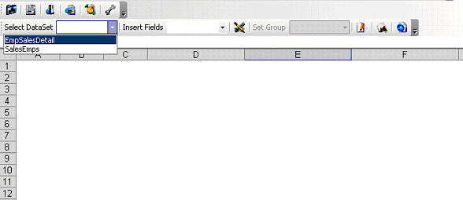

{} 

Users can design and deliver reports into Microsoft Excel directly using Aspose.Cells.Report.Designer, a simple and easy‑to‑use tool. They don't need to use Visual Studio to create reports but can save the cost of buying additional Visual Studio licenses and do not have to spend time learning how to use a complex development environment.

Since Aspose.Cells.Report.Designer uses Microsoft Excel as a report template, users can take advantage of all the powerful functionality and features in Microsoft Excel, including Pivot Tables, interactive charts, VBA, macros, and formulas. Not all of these features are supported by the standard Microsoft Excel format that Reporting Services delivers.

{} 
- **The Aspose.Cells.Report.Designer toolbar**  
**Users can utilize the Aspose.Cells.Report.Designer toolbar to manipulate an RDL report file** 

