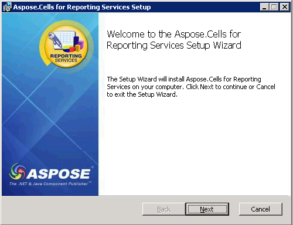
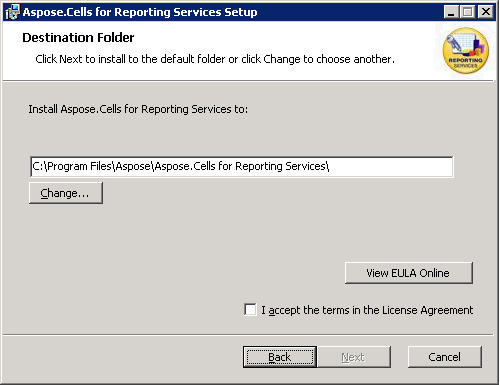
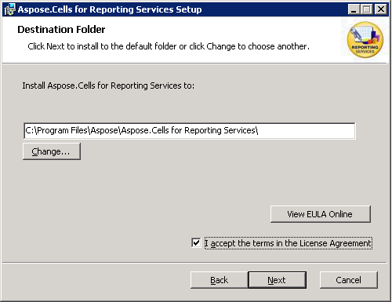
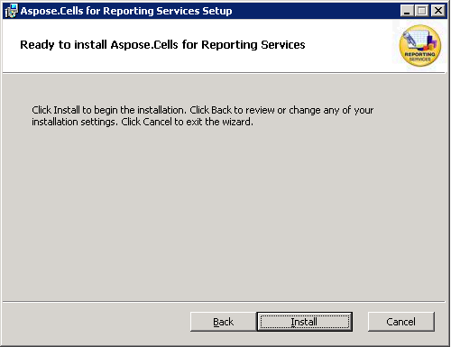
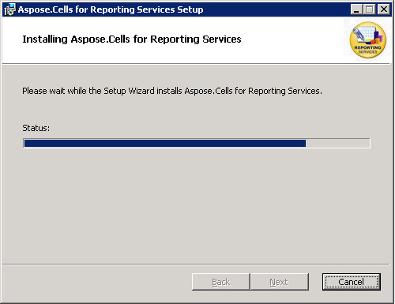
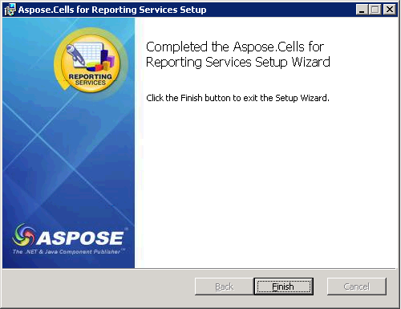

{}

- If you have a previous version of **Aspose.Cells for Reporting Services** installed, uninstall it first. See the **[Uninstalling Aspose.Cells for Reporting Services](/cells/reportingservices/uninstalling-aspose-cells-for-reporting-services/)** topic for detailed instructions.  
- Download the latest MSI installer from the **[Aspose.Cells for Reporting Services download page](https://releases.aspose.com/cells/reportingservices/)**.  
  - The MSI package supports **Microsoft SQL Server 2008 Reporting Services and later**.  
- Run the downloaded file and follow the installer wizard.

{}

## Installation Process

The installation wizard consists of a series of screens. Follow the steps below to complete the installation.

### 1. Welcome Screen  

Click **Next** to start the wizard.

### 2. License Agreement  

Read the End‑User License Agreement (EULA), select **I accept the terms in the license agreement**, and click **Next**.

### 3. Choose Installation Folder  

Select the destination folder where the component will be installed (the default path is usually fine) and click **Next**.

### 4. Confirm Installation  

Review the summary and click **Install** to begin copying files.

### 5. Installation Progress  

The installer displays a progress bar while the files are being copied.

### 6. Completion  

When the process finishes, click **Finish** to close the wizard.

## Post‑Installation Checklist

- **Verify the installation**: Open **SQL Server Reporting Services** and confirm that the Aspose.Cells extension appears under the **Extensions** tab.  
- **Verify Excel Add-ins** (if required) Open Excel and check if the Aspose.Cells Report Designer add-in is installed.
