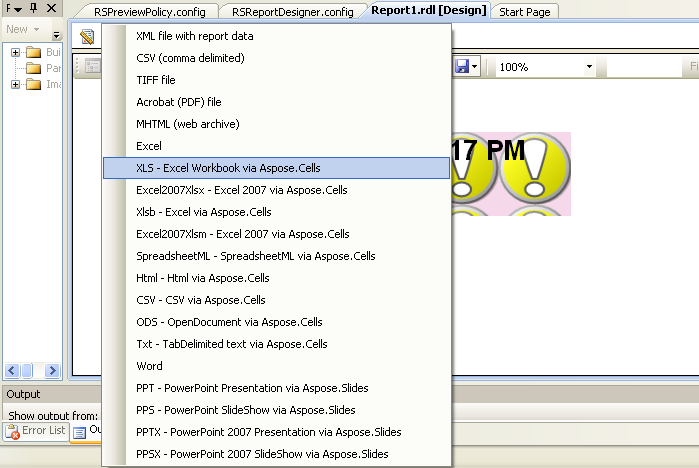

{} 

Please perform the following steps in order if you want **to** install Aspose.Cells for Reporting Services manually for Microsoft Visual Studio Report Designer, without the MSI installer. We recommend you use the MSI installer because it performs all necessary installation and configuration automatically. However, if you **cannot** install with the MSI installer, then please follow **these** guidelines.  
This section describes how to install Aspose.Cells for Reporting Services on a computer with Business Intelligence Development Studio. This will enable you to export reports to Microsoft Excel formats at design time from the Microsoft Visual Studio 2005 or 2008 Report Designer. 

{} 
- **Integration Process**
1. Copy **Aspose.Cells.ReportingServices.dll** to the Visual Studio directory.  
   1. To integrate with Visual Studio 2005 Report Designer: copy **Aspose.Cells.ReportingServices.dll** to the `C:\Program Files\Microsoft Visual Studio 8\Common7\IDE\PrivateAssemblies` directory.  
   2. To integrate with Visual Studio 2008 Report Designer: copy **Aspose.Cells.ReportingServices.dll** to the `C:\Program Files\Microsoft Visual Studio 9.0\Common7\IDE\PrivateAssemblies` directory.  
2. Register Aspose.Cells for Reporting Services as a rendering extension:  
   1. Open `C:\Program Files\Microsoft Visual Studio <Version>\Common7\IDE\PrivateAssemblies\RSReportDesigner.config`  
      (where `<Version>` is **“8”** for Visual Studio 2005 or **“9.0”** for Visual Studio 2008) and add the following lines to the `<Render>` element:  

**XML**


<Extension Name="ACXLS"  Type="Aspose.Cells.ReportingServices.XlsRenderer,Aspose.Cells.ReportingServices" />
<Extension Name="ACXLSX" Type="Aspose.Cells.ReportingServices.Excel2007XlsxRenderer,Aspose.Cells.ReportingServices" />
<Extension Name="ACXLSB" Type="Aspose.Cells.ReportingServices.XlsbRenderer,Aspose.Cells.ReportingServices" />
<Extension Name="ACXLSM" Type="Aspose.Cells.ReportingServices.Excel2007XlsmRenderer,Aspose.Cells.ReportingServices" />
<Extension Name="ACXML"  Type="Aspose.Cells.ReportingServices.SpreadsheetMLRenderer,Aspose.Cells.ReportingServices" />
<Extension Name="ACHTML" Type="Aspose.Cells.ReportingServices.HtmlRenderer,Aspose.Cells.ReportingServices" />
<Extension Name="ACCSV"  Type="Aspose.Cells.ReportingServices.CSVRenderer,Aspose.Cells.ReportingServices" />
<Extension Name="ACODS"  Type="Aspose.Cells.ReportingServices.ODSRenderer,Aspose.Cells.ReportingServices" />
<Extension Name="ACTXT"  Type="Aspose.Cells.ReportingServices.TabDelimitedRenderer,Aspose.Cells.ReportingServices" />


3. Give Aspose.Cells for Reporting Services permissions to execute:  
   1. Open `C:\Program Files\Microsoft Visual Studio <Version>\Common7\IDE\PrivateAssemblies\RSPreviewPolicy.config`  
      (where `<Version>` is **“8”** for Visual Studio 2005 or **“9.0”** for Visual Studio 2008) and add the following as the last item in the second **outer** `<CodeGroup>` element (which should be `<CodeGroup class="FirstMatchCodeGroup" version="1" PermissionSetName="Execution" Description="This code group grants MyComputer code Execution permission.">`):  

**XML**


<CodeGroup>
  ...
  <CodeGroup>
    ...
    <!--Start here.-->
    <CodeGroup class="UnionCodeGroup" version="1" PermissionSetName="FullTrust" Name="Aspose.Cells_for_Reporting_Services" Description="This code group grants full trust to the Aspose.Cells for Reporting Services assembly.">
      <IMembershipCondition class="StrongNameMembershipCondition" version="1" PublicKeyBlob="00240000048000009400000006020000002400005253413100040000010001002780c08eaa89aedfb00b1b96137cca3e15f32826e0e4fd1da3c98d1e3968a03a019aa7b7228b151f6e5dae4dcb00f98479770f507626b04e786e5e93ec3757c1cc4ed1ac4b72c7649c4438e9d3a5f44d8b7522043686a2e8c2a495e04b917e0505d3201015c828e3c15afc8a46ab78293574b9e0475df68627bbabc5b564addd" />
    </CodeGroup>
    <!--End here.-->
  </CodeGroup>
</CodeGroup>


4. Verify that Aspose.Cells for Reporting Services was installed successfully:  
   1. Run or restart Microsoft Visual Studio 2005 or 2008 Report Designer.  
      You should notice **that** new formats are available in the list of export formats.  

**When the component has been registered, new export formats appear in Report Designer**  

