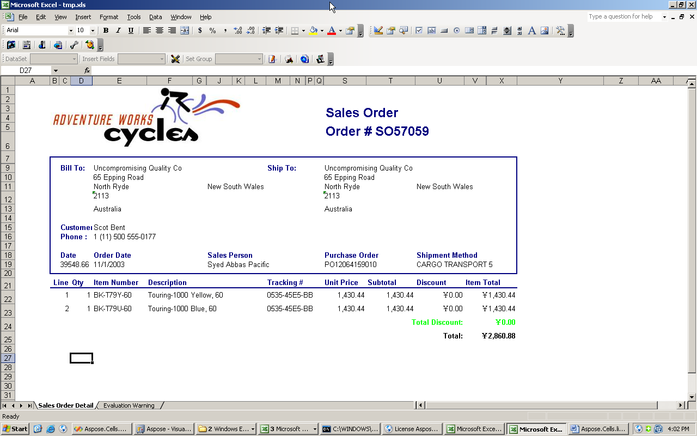
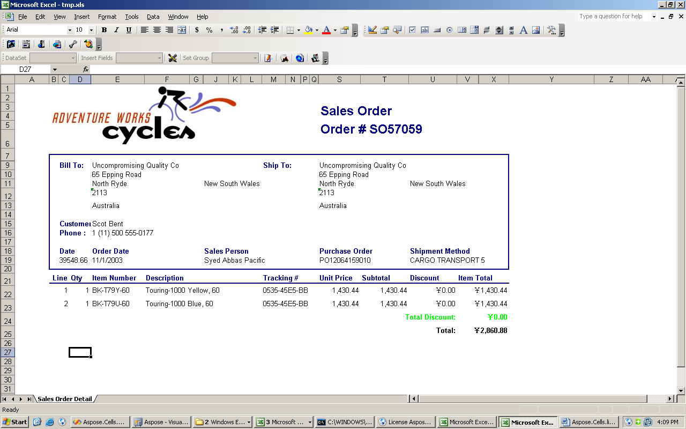
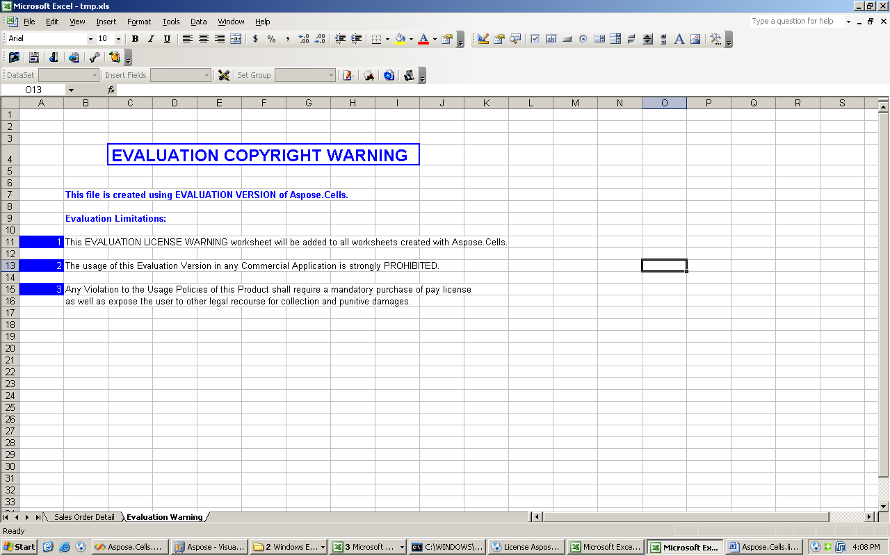

{} 

Aspose.Cells for Reporting Services is available as a free, time‑unlimited evaluation from the [Download Page](https://downloads.aspose.com/cells/reportingservices). The evaluation and licensed versions of the product are the same.

When you are happy with the evaluation version, buy a license. Make sure you understand and agree to the subscription terms and conditions.

{} 
### **Getting and Using the License**
The license will be available for download from the order page when the order is paid.

The license file is a clear‑text, digitally signed XML file. The license file contains information such as the client name, the purchased product, and the license type. Do not modify the content of the license file, as doing so invalidates it.

Download the license to your computer and copy it to a folder that must be one of the following:

- $[Installation Folder]\License\
- $[MSSQL Server Reporting Services]\ReportServer\Bin\
- $[MSSQL Server Reporting Services]\ReportServer\

The name of the license file can be one of the following based on your subscription type:

- Aspose.Cells.Reporting.Services.lic
- Aspose.Total.ReportingServices.lic
- Aspose.Custom.lic
- Aspose.Total.lic
- Aspose.Cells.Reporting.Services - Developer Site Subscription.lic
- Aspose.Cells.Reporting.Services - Developer Subscription.lic
- Aspose.Cells.Reporting.Services - Multiple Deployment Subscription.lic
- Aspose.Cells.Reporting.Services - Single Server Deployment Subscription.lic

To test whether the license file was installed correctly, export any report as a Microsoft Excel workbook. If the workbook contains no watermark worksheet at the end, the license file was activated successfully.

Aspose.Cells for Reporting Services injects an evaluation watermark worksheet when working in evaluation mode. When a valid license file is present, for example when **Aspose.Cells.ReportingServices.lic** is in the $[Installation Folder]\License\ folder, there is no evaluation watermark worksheet.

**A file created in evaluation mode. Note the second worksheet.** 

**A file created with a full license** 

{} 

If there is any problem with the license file, the error message will be included in the generated report.

{} 

**Error message indicating licensing issue** 

