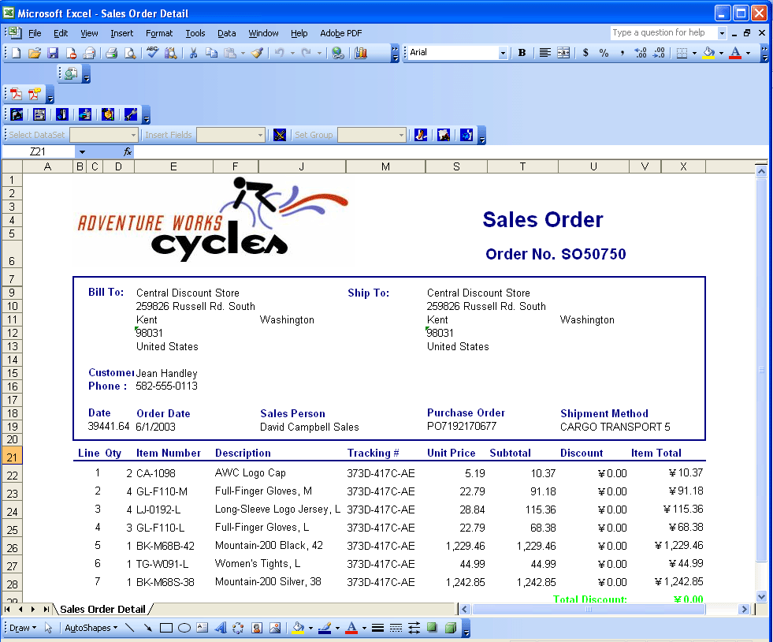

{: .align-center .mb-4 }

# Aspose.Cells for Reporting Services – Product Overview

Aspose.Cells is an award‑winning spreadsheet component that lets developers **read, write, and manipulate Excel files** without requiring Microsoft Excel.  
The **Aspose.Cells for Reporting Services** solution extends this capability to Microsoft SQL Server Reporting Services (SSRS), enabling you to design, render, and export Excel‑based reports directly from SSRS.

## 📖 Table of Contents

1. [Why Use Aspose.Cells for Reporting Services?](#why-use)
2. [Key Components](#components)
   - [Aspose.Cells.Report.Designer](#designer)
   - [Aspose.Cells.Renderer for Reporting Services](#renderer)
3. [Designing Reports](#designing-reports)
   - [Option 1 – Start from a Blank Excel Template](#blank-template)
   - [Option 2 – Use an Existing RDL Report](#existing-rdl)
4. [Sample Report](#sample-report)
5. [Getting Started Quickly](#getting-started)
6. [Further Reading](#further-reading)

## Why Use Aspose.Cells for Reporting Services?

- **No Excel installation required** – All operations are performed server‑side.
- **Full Excel feature set** – Leverage formulas, charts, pivot tables, conditional formatting, and more.
- **Seamless SSRS integration** – Works as a native rendering extension; reports can be published to Report Server like any other SSRS report.
- **Two‑stage workflow** – Design in Excel (familiar UI) and render in SSRS (robust reporting platform).

## Key Components

### 1. Aspose.Cells.Report.Designer

- **Add‑in for Microsoft Excel** – Provides a visual designer ribbon inside Excel.
- **Report template creation** – Build the layout, add placeholders, and define data‑binding expressions directly in Excel.
- **Embedding into RDL** – The designed template is packaged into an SSRS RDL file, ready for deployment.
- **Preview & Export** – Test the report inside Excel before publishing.

### 2. Aspose.Cells.Renderer for Reporting Services

- **SSRS rendering extension** – Implements Microsoft’s Rendering Extension interface.
- **Supports RDL from Visual Studio or Designer** – Handles reports created with either tool.
- **Multiple output formats** – Export to XLSX, CSV, PDF, HTML, and image formats.

## Designing Reports

You can create reports using **one of two approaches**:

### Option 1 – Start from a Blank Excel Template

1. Open Excel → **Aspose.Cells → New Report**.  
2. Define data sources, create queries, and bind Excel cells to those data fields.  
3. Save the workbook; the add‑in automatically generates the accompanying RDL file.  
4. Publish the RDL to Report Server.

### Option 2 – Use an Existing RDL Report

1. Create the RDL in Visual Studio with all required data sources and queries.  
2. In Excel, open **Aspose.Cells → Attach to RDL** and design the layout using the existing dataset.  
3. Save – the Excel template is embedded into the RDL, preserving the original queries.

> **Tip:** Use Option 2 when you want database experts to manage queries while designers focus solely on the visual layout.

## Sample Report Rendered with Aspose.Cells for Reporting Services

{: .align-center .mt-4 }

The image above shows a typical Excel‑styled report rendered in the SSRS web portal, complete with charts, conditional formatting, and data tables.

## Getting Started Quickly

| Step | Action | Details |
|------|--------|---------|
| **1** | **Install the add‑in** | Download from the Aspose website and run the MSI on any workstation with Excel. |
| **2** | **Add the renderer extension** | Copy `Aspose.Cells.Renderer.dll` to the `<ReportServer>\bin` folder and edit `RSReportServer.config` to register the extension. |
| **3** | **Create a template** | Open Excel → **Aspose.Cells → New Report**, then design your layout. |
| **4** | **Publish** | Deploy the generated RDL to the Report Server using the SSRS web portal or Visual Studio. |
| **5** | **Run & Export** | View the report in a browser, export to XLSX, PDF, or any supported format. |

For a step‑by‑step walkthrough, see the **[Getting Started Guide](/cells/reportingservices/getting-started/)**.

## Further Reading

- **[Aspose.Cells for Reporting Services Documentation Home](/cells/reportingservices/)** – Full list of tutorials, API references, and sample projects.  
- **[How to Use Aspose.Cells.Report.Designer](/cells/reportingservices/designer/)** – Detailed guide on Excel‑based report creation.  
- **[Rendering Extension Configuration](/cells/reportingservices/renderer-configuration/)** – Instructions for installing and configuring the renderer on a Report Server.
