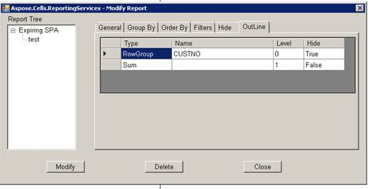
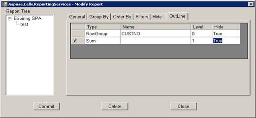
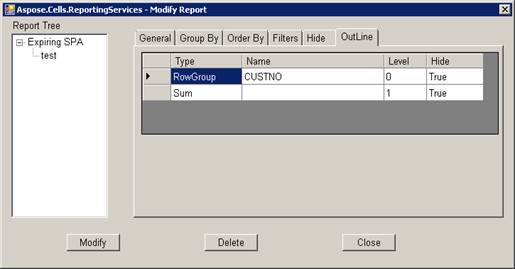

It sets the Group attributes of table report item through Modify Attributes. The parameters include Type, Name, Level and Hide.

- Type represents Group Type. It includes Row Group and Column Group.
- Name represents Group name.
- Level represents Group level.
- Hide represents Group hide.

Modifying Report involves the following steps:
Open “Modify Report” dialog box and choose Outline tab.

Click **Modify** button and update Hide configuration. 

Click **Commit** button and save hide configs. 

