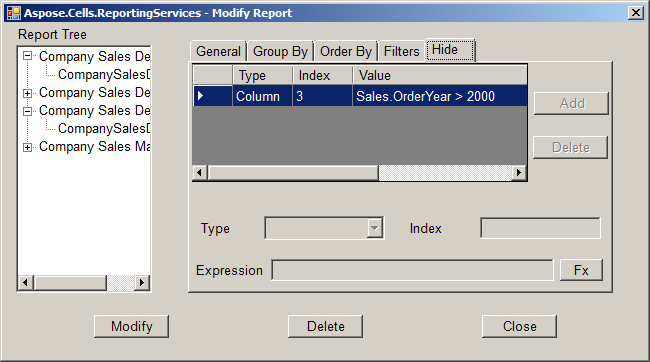

Set a table report's hide attributes from **Modify Attribute**. Parameters include:

- **Type** represents the hide object type. It includes table, row and column.
- **Index** represents the hide object' position. When type is worksheet, the value is null. The index value starts from 0.
- **Expression** represents the hide state Value. The value is true, false or an Excel formula. The expression supports Reporting Services formula.

**Setting a table report's hide attributes** 

