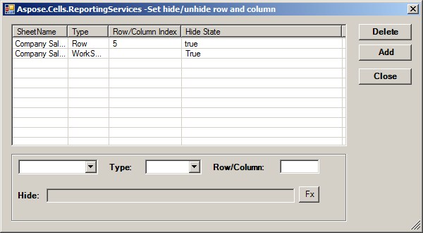

Aspose.Cells for Reporting Services hides any specified row, column and sheet based set in the Hide parameters. The parameters include:

- **SheetName** represents a worksheet which specifies a hide object.
- **Type** represents the hide object type. It includes worksheet, row and column.
- **Row/Column Index** represents the specified hide object. When the type is worksheet, the value is null. Column index supports character. The index value starts from 1.
- **Hide State** represents the hide state value. The value is true, false or an Excel formula. The parameter only supports Reporting Services report parameters.

**Specifying hide options** 

