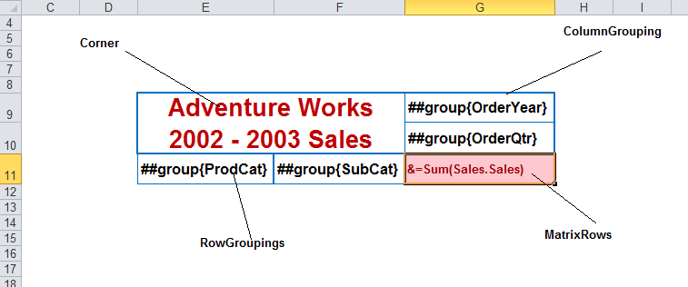

{} 

We incorporated support to create a matrix report item in a report. The matrix context includes corner, column groupings, row groupings and matrix rows. Set matrix report attributes which include name, range and so on through **Set Attribute** button in Aspose.Cells’ command bar in Excel.

For example, in the screenshot below, the matrix range is E9:G11.

**A matrix report item** 

{}
