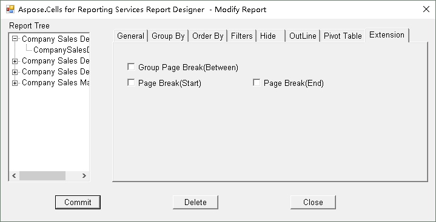

## Overview

In SSRS a **Tablix** (table, matrix, or list) can be split into separate pages by inserting a page break between its groups.  
The *Group Page Break (Between)* option controls whether a new page starts **before**, **after**, or **between** each instance of a group.  
If no page break is required, the default setting is **None**.

> **Tip:** Adding group page breaks improves the readability of printed reports and helps users navigate large datasets.

## When to Use a Group Page Break

| Scenario | Benefit |
|----------|---------|
| Long detail rows that span multiple pages | Prevents rows from being cut off mid‑group. |
| Printed reports that must start a new section for each group (e.g., invoices per customer) | Guarantees each group begins on a fresh page. |
| Exporting to PDF where each group should be a separate document chapter | Keeps PDF pagination clean and predictable. |

## **Visual Guide - How to add a Group Page Break**

It sets the Group Page Break (Between) and Page Break for a table report item. The default value is set to No Page Break.

