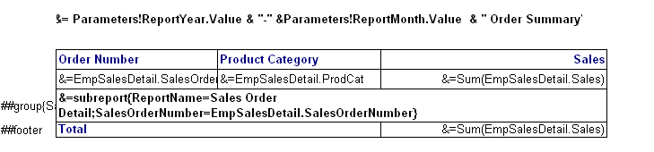

**New Feature:** You can now embed a sub‑report directly inside a *table group row*. Use the following syntax:  

```text
&=subreport{ReportName=YourReportName; Parameter1Name=Parameter1Value; Parameter2Name=Parameter2Value; …}
```  

## 📌 Overview

A *sub‑report* is a separate report that is rendered inside a parent report. This capability is useful when you need to display related data (e.g., order details) for each group row in a master table.

## 🛠 Embedding a Sub‑Report in a Table

### Example – Sub‑Report in a Table Group Row

Below is a screenshot of a master‑detail report where the sub‑report **Sales Order Detail** is placed in the group row of the **Sales Orders** table.



**Explanation**

| Item | Value |
|------|-------|
| **Sub‑Report Name** | `Sales Order Detail` |
| **Parameter** | `SalesOrderNumber` |
| **Parameter Value** | `EmpSalesDetail.SalesOrderNumber` |

The sub‑report receives the current row’s `SalesOrderNumber` and renders the matching order lines.

## 📋 Syntax Details

```text
&=subreport{
    ReportName=YourReportName;
    Parameter1Name=Parameter1Value;
    Parameter2Name=Parameter2Value;
    …
}
```

* **ReportName** – Exact name of the sub‑report file (without the `.xlsx` extension).  
* **ParameterXName** – Name of a parameter defined in the sub‑report.  
* **ParameterXValue** – Expression that resolves to the value you want to pass (e.g., a field from the parent table).

> **Tip:** Separate each *name/value* pair with a semicolon (`;`). Do **not** include spaces around the equals sign.

## 🚫 Restrictions on Using Sub‑Reports

| # | Restriction | Reason |
|---|-------------|--------|
| 1 | The sub‑report **must be created** with the **Aspose.Cells Reporting Services Designer** tool. | Guarantees compatibility with the embedding engine. |
| 2 | Sub‑reports can only be placed **inside a table group row**. The group row **cannot contain any other elements** (e.g., text boxes, images). | Prevents layout conflicts and ensures a clean rendering pipeline. |
| 3 | Embedding a sub‑report in **detail rows**, **footer rows**, or **header rows** is **not supported**. | These rows are rendered differently and do not provide a stable container for a nested report. |
| 4 | **Nesting depth** is limited to **one level** – a sub‑report cannot itself contain another embedded sub‑report. | Current engine limitation; future releases may lift this restriction. |
