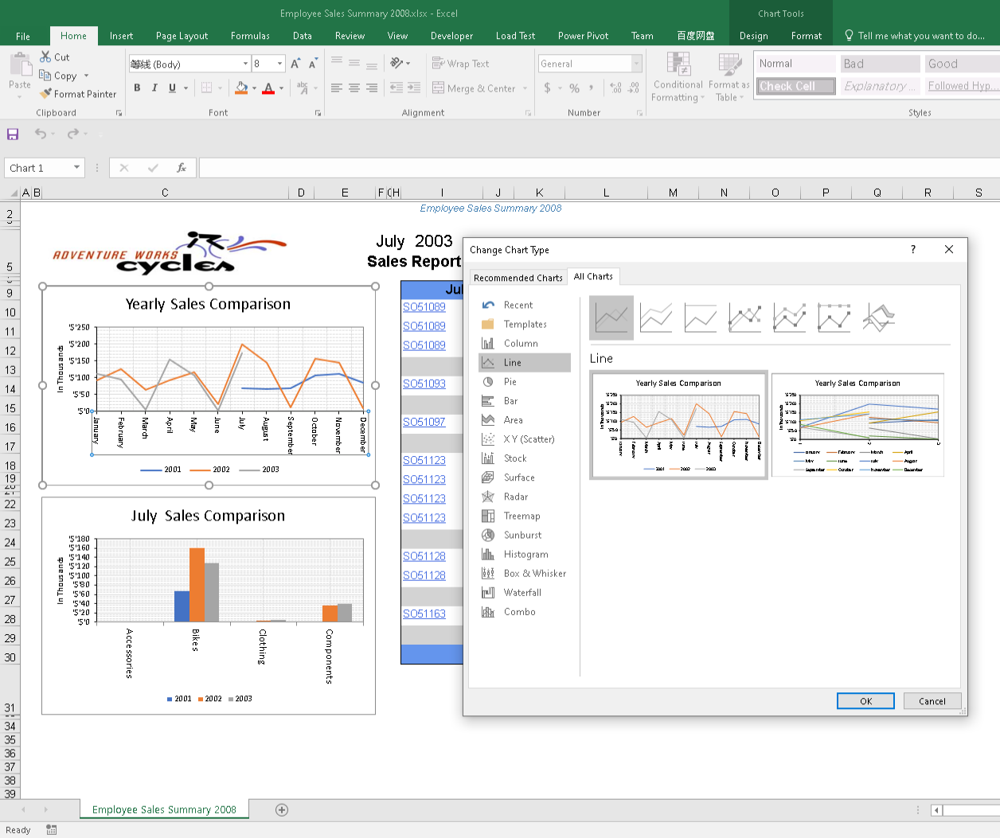

{} 

To render all chart items in a report as editable Excel charts:

1. Open the **Aspose.Cells.ReportingServices.xml** file.
1. Modify the configuration parameters as follows: 



 <Chart value="all">

</Chart>



When value is set to “all”, all chart items are rendered as editable charts. 

**Editing charts in Excel** 

{}
