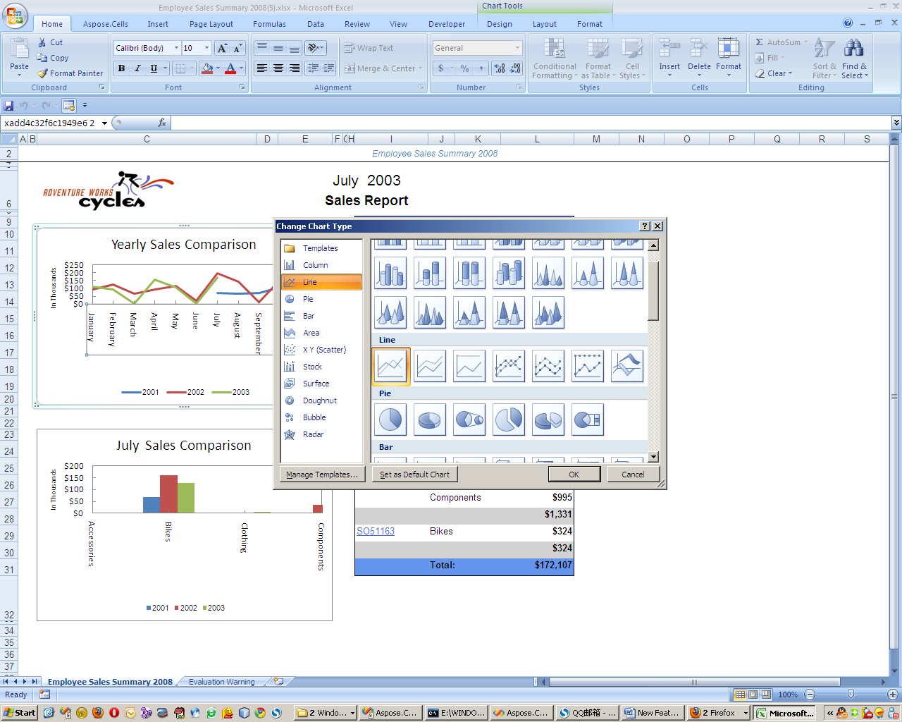

## How to render chart items to Microsoft Excel charts

Follow the three steps below to enable native Excel chart generation for a specific report.

1. **Open** the `Aspose.Cells.ReportingServices.xml` configuration file.  
2. **Edit** the file to include the chart‑rendering settings for your report.  
3. **Save** the file and refresh the report in Reporting Services.

Below is a minimal example that shows how to configure the `Employee Sales Summary 2008` report.


<Chart>
    <Report name="Employee Sales Summary 2008"/>
</Chart>


**Result:** The chart items defined in the selected report will be exported as editable Microsoft Excel charts.

> **Note:** Once the Excel file is generated, you can modify the charts directly in Microsoft Excel.

{: .responsive width="100%" alt="Excel chart generated from Aspose.Cells Reporting Services"}

## Prerequisites

- Aspose.Cells for Reporting Services installed on the server.  
- Access to the `Aspose.Cells.ReportingServices.xml` configuration file (usually located in the Reporting Services application folder).  
- A report that contains one or more chart items.

## Detailed Steps

### 1. Locate the configuration file

The file is typically found at:

```
%ProgramFiles%\Microsoft SQL Server\MSRS13.MSSQLSERVER\Reporting Services\ReportServer\Aspose.Cells.ReportingServices.xml
```

or

   ```text
   C:\Program Files\Aspose\Aspose.Cells for Reporting Services\Aspose.Cells.ReportingServices.xml
   ```

If you have a custom installation path, adjust accordingly.

### 2. Add the `<Chart>` section

Insert a `<Chart>` node (or edit an existing one) that references the exact name of the report you want to export as Excel charts.

```xml
<Chart>
    <Report name="Employee Sales Summary 2008"/>
</Chart>
```

> **Tip:** The `name` attribute must match the **display name** of the report as it appears in Report Manager.

### 3. Save and test

After saving the file:

1. Open the report in **Report Manager** or **Power BI Report Server**.  
2. Export the report using **Excel** as the format.  
3. Verify that the chart appears as a native Excel chart (you can double‑click it in Excel to edit).

## Frequently Asked Questions

| Question | Answer |
|----------|--------|
| *Can I render charts for multiple reports?* | Yes. Add a separate `<Report>` element for each report inside the same `<Chart>` node. |
| *What if the chart does not appear in Excel?* | Ensure the report name is correct, the XML is well‑formed, and the Aspose.Cells version you are using supports chart rendering. |
| *Do I need to restart Reporting Services?* | No restart is required; the changes are read at the next export request. |
