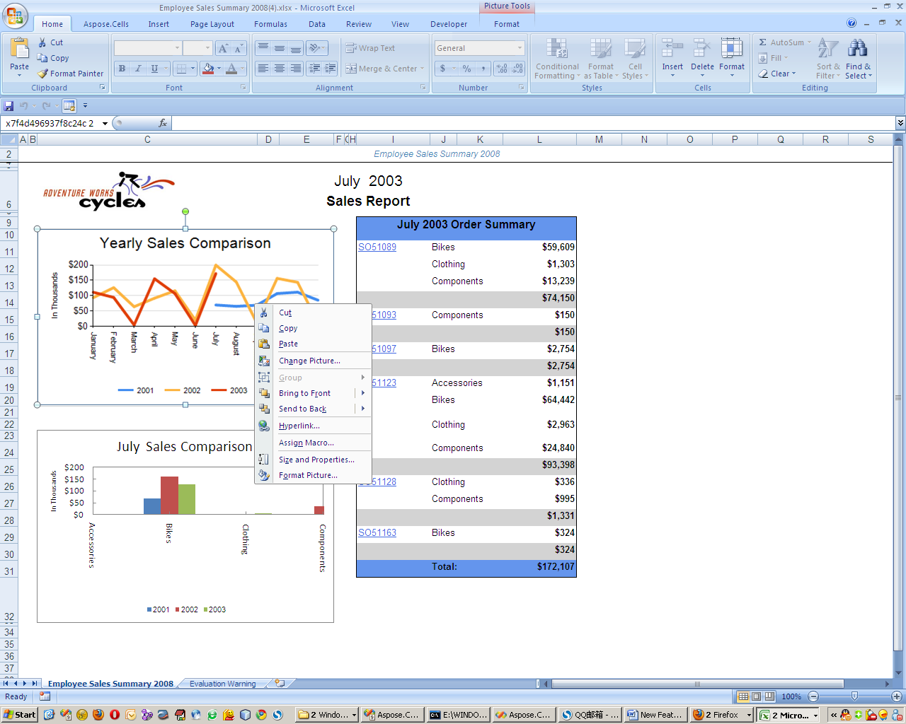
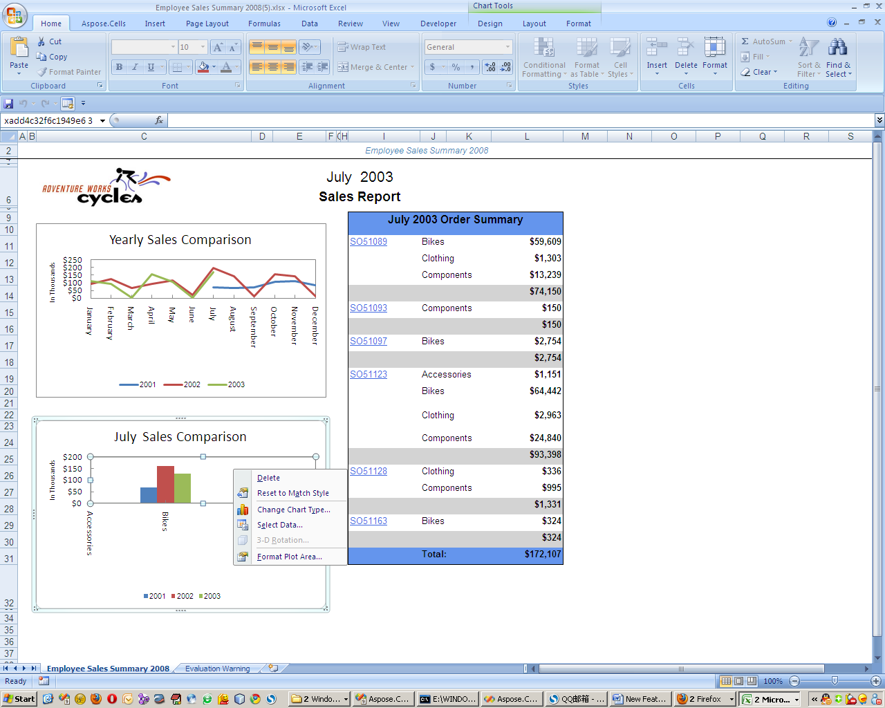

## How to export only specific charts as editable Excel charts

When you need a mix of **editable Excel charts** and **static images** in the same report, follow these steps:

1. **Open** the `Aspose.Cells.ReportingServices.xml` configuration file.  
2. **Locate** the `<Chart>` section (or add it if it doesn’t exist).  
3. **Add** a `<Report>` node for the report you want to customize.  
4. **Specify** each chart you want to render as an image by setting `type="image"`.  
   All charts **not** listed will be exported as editable Excel charts.

## Example configuration

```xml
<Chart>
    <Report name="Employee Sales Summary 2008">
        <!-- This chart will be exported as a static image -->
        <ChartItem name="Chart1" type="image"/>
    </Report>
</Chart>
```

### Result

- **Chart rendered as an image**

  

- **Chart rendered as an editable Excel chart**

  

## Additional Tips

- **Multiple charts**: Add a `<ChartItem>` entry for each chart you want to treat as an image.
- **Case‑sensitivity**: Ensure the `name` attribute matches the exact chart name defined in the SSRS report.
- **Testing**: After updating the XML, regenerate the Excel export to verify that the correct charts are rendered as images.
