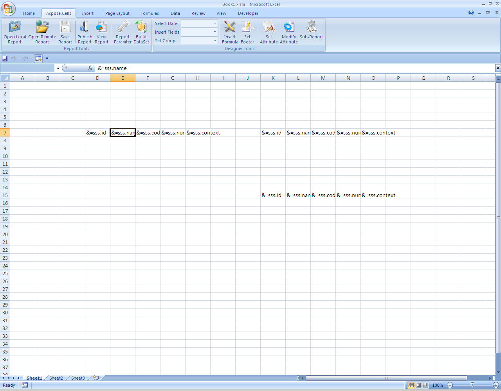

**Aspose.Cells for Reporting Services Designer** supports Microsoft Excel 2007 and 2010 custom user‑interface (UI) extensions.  You can use this feature to give your generated workbooks a fresh, modern look without writing any VBA code.

> **Note:**  The same API works with newer Excel versions (2013, 2016, 2019, Office 365) because the custom UI format is backward‑compatible.

## 📖 Overview

Microsoft introduced the **Custom UI** (also known as *Ribbon XML*) in Excel 2007. It lets developers replace or extend the default ribbon, tabs, and controls with their own layout and commands.  
Aspose.Cells for Reporting Services Designer reads the `customUI` part of an Excel package and injects it automatically during rendering, so the final workbook displays the custom ribbon you designed.

**Visual Guide - Aspose.Cells supports the latest version of Microsoft Excel**

