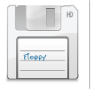
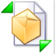
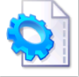

The following table shows the command bar icons and tools on the Aspose.Cells.Report.Designer add‑in's toolbar.

|**Command** |**Image** |**Description** |
| :- | :- | :- |
|Open Local Report ||Opens an RDL file from the local PC and loads the file's content. |
|Open Remote Report ||Opens an RDL file from the Report Server and loads the file's content. |
|Save Report ||Saves the designed report locally or on the server. |
|Publish Report ||Uploads the RDL file to the server. |
|View Report ||Displays a preview of the report from the server. |
|Build DataSet and Data Source ||Builds datasets and data sources. |
|Modify Report Parameter ||Modifies report parameters and their relation to query parameters. |
|Insert Formula ||Inserts a formula into the cell through the formula editor window. |
|Set Attribute ||Sets some of the report attributes: report name, report range, group fields, order fields, and so on. |
|Modify Attribute ||Modifies some of the report attributes: report name, report range, group fields, order fields, and so on. |
|Set Footer ||Inserts '##footer' into the cell. |
