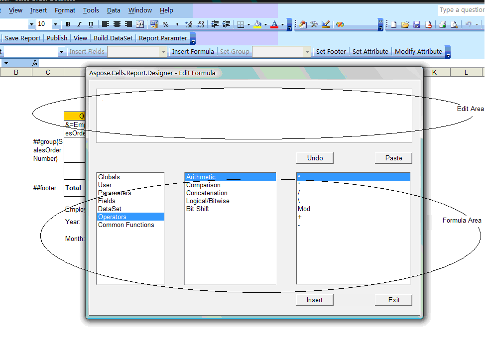

---  
title: Formula Editor Window  
type: docs  
weight: 20  
url: /reportingservices/formula-editor-window/  
ai_search_scope: cells_reportingservices  
ai_search_endpoint: "https://docsearch.api.aspose.cloud/ask"
---  

{}  

The Formula Editor lets you create formulas for a report.  

{}  

To edit a formula in a Microsoft Excel cell:  

1. In Microsoft Excel, select a cell.  
1. Open the Edit Formula dialog by clicking **Edit Formula** on the toolbar.  
   ([Adding Reporting Services Formulas](/cells/reportingservices/adding-reporting-services-formulas/) walks through an example that edits a formula.)  
   The dialog is divided into **sections**: the edit area at the top, and the formula area at the bottom. Use the formula area to populate the edit area.  
1. Select a category (user, parameters, fields, etc.) from the **Report Fields** list (the left‑hand list).  
1. Select the type from the **Functions** list (in the middle).  
1. Select an option from the **Operators** list (the right‑hand list).  
1. Click **Insert** to add the expression to the **Edit** area.  
1. Click **Insert** when the expression is complete.  
   The formula is inserted into the cell.  

**The Edit Formula Dialog**  

  

The Edit Formula dialog is divided into sections, described below.  

#### **Edit Area**  
This is the area where you create or edit a formula. Create a formula by double‑clicking on any of the components listed in the **Report Fields**, **Functions**, or **Operators** lists. When you choose a component, the required syntax is also inserted. You can also manually enter a formula.  

#### **Formula Area**  
The formula area contains three sections, each listing information used to build a formula.  

- **Report Fields** – the left‑hand list lists all the database fields accessible for the report. It also lists any formulas or groups already created.  
- **Functions** – the middle list contains functions, pre‑built procedures that return values. They perform calculations such as AVERAGE, SUM, COUNT, SIN, UPPERCASE, and so on.  
- **Operators** – the “action verbs” used in formulas. Operators describe an operation or an action to take place between two or more values. Examples of operators: add, subtract, less than, greater than, etc.  

#### **Controls**  
The dialog has several controls:  

| **Button Name** | **Description** |
| :- | :- |
| Undo | Undoes an action. |
| Paste | Pastes a character string made up of the components listed in the formula area into the edit area. |
| Insert | Takes the value in the edit area and inserts it as a formula into a cell. |
| Exit | Closes the Formula Editor. |

{}  

Related topics:  

- [Formula List](/cells/reportingservices/formula-list/) – a list of fields and operators.  

{}
