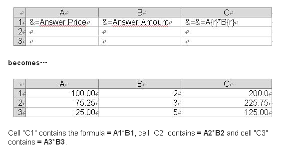

---  
title: Aspose.Cells Template and Smart Markers  
type: docs  
weight: 30  
url: /reportingservices/aspose-cells-template-and-smart-markers/  
ai_search_scope: cells_reportingservices  
ai_search_endpoint: "https://docsearch.api.aspose.cloud/ask"
---  

{}  

An Aspose.Cells template is a Microsoft Excel workbook that contains Smart Markers. Smart Markers act as data placeholders for report items and are replaced with the corresponding data at rendering time. There are five types of smart markers, listed below. All the markers can be inserted into a template by Aspose.Cells.Report.Designer. They can also be edited manually.  

{}  

### **Smart Markers**  

#### **Data Markers**  
The format of **data markers** is &=DataSetName.FieldName. For example: &=SalesDetail.sales where SalesDetail is the name of a data set or query and sales is the name of one of its fields. At rendering time, data markers are replaced with the values of the dataset provided by Reporting Services.  

#### **Reporting Services Formulas Markers**  
The format of Reporting Services' **formula markers** is &=expression. For example: &=sum(SalesDetail.sales)/100. The expression consists of functions, dataset fields, operators, and so on. At rendering time, Reporting Services formula markers are replaced with computed values.  

#### **Reporting Services Global Variable Markers**  
The format of Reporting Services' **global variable markers** is &=Globals!VariableName. For example: &=Globals!ExecutionTime where ExecutionTime is the name of a global variable. Global variable markers are replaced with global variable values at rendering time.  

#### **Reporting Services Parameters Markers**  
A report parameter has two attributes: value and label. Consequently, **parameter markers** have two formats: =&Parameters!ParamName.Value and =&Parameters!ParamName.Label. They indicate the name and the label of the parameter respectively. At rendering time, parameter markers are replaced with the parameter values entered by the user.  

#### **Dynamic Formulas**  
In order to make calculations on inserted rows, use dynamic formulas. **Dynamic formulas** allow you to insert Microsoft Excel's formulas into cells even when a formula references rows that will be inserted during the export process. They can be repeated for each inserted row or used only with cells where data markers are placed for them.  

The format of dynamic formulas is =&RepeatDynamicFormula.  

Dynamic Formulas allow the following additional options:  

- {r} – Current row number.  
- {2}, {-1} – Offset to current row number.  

**A repeating dynamic formula and the resulting Excel worksheet**  

