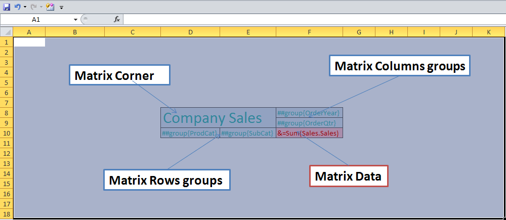
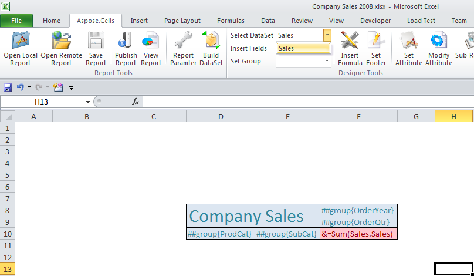
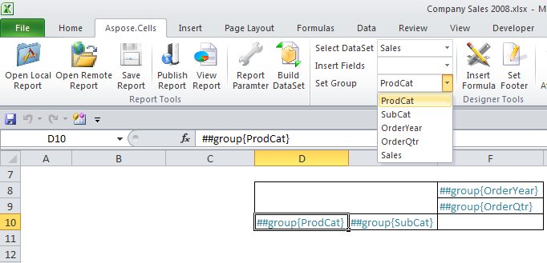
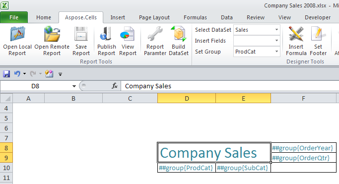
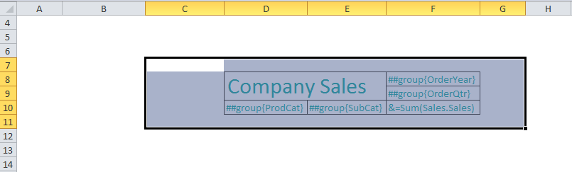
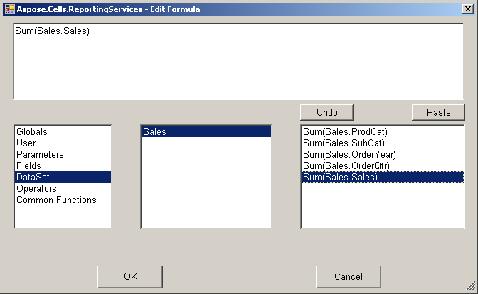
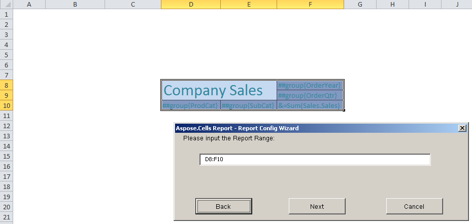
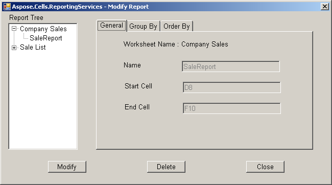

{} 

Aspose.Cells for Reporting Services lets you design a matrix in Microsoft Excel. 

{} 
### **Matrix Template**
In an Aspose.Cells report template, a matrix consists of corner, rows groups, column groups and data portions. A sample matrix is shown below.

**A sample matrix** 

- **Matrix corner**: located in the upper-left corner, or upper-right corner for right-to-left (RTL) layouts. This area is automatically created when you add both row groups and column groups to a matrix data region. In this area, you can merge cells embedded textbox report item.
- **Matrix column groups area**: located in the upper-right corner (upper-left corner for RTL layout). This area is automatically created when you add a column group. The cells in this area represent members of the column groups hierarchy, and display the column group instance values. In the figure, the cells that display OrderYear is a nested column group, and the cell that displays OrderQtr is an adjacent column group.
- **Matrix row groups area**: located on the lower-left corner (lower right for RTL layout). This area is automatically created when you add a row group. The cells in this area represent members of the row groups hierarchy, and display row group instance values. In the figure, these cells are nested row groups.
- **Matrix data area**: located in the lower right corner (lower left for RTL layout). The matrix data displays detail and grouped data. In this example, only aggregated data is used. By default, the cells in a group row or column that contain simple expressions that do not include an aggregate function, evaluate to the first value in the group. In the figure, the cells display the aggregate totals for the line totals for all sales orders.
#### **Creating a Matrix Template**
Before creating a matrix report, create the data sources, datasets and report parameters (optional). (Follow the instructions in [Data Sources and Queries](/cells/reportingservices/data-sources-and-queries/) if you need assistance.) In the sample, we use the AdventureWorks sample database that ships with SQL Server Reporting Services 2008.

To create a new matrix:

1. Open Microsoft Excel.
1. Click **Open Report** to open an RDL Report file that contains the data sources, datasets and report parameters created in advance.
   Once the file has been opened successfully all its information is available for use, for example, its datasets are listed in the **DataSet** list.
1. Open a Microsoft Excel worksheet and select a data set. 

1. Set row groups and column groups through **Set Group**. 

1. Merge cells to set matrix corner.

1. Set matrix corner through inserting a formula. 

1. Click **Set Attribute** to set matrix attribute. 

It consists of name, range, group and order.

1. Clicking modify attribute checks and modifies all matrix attributes of the current worksheet.

1. Save, publish and review report.
