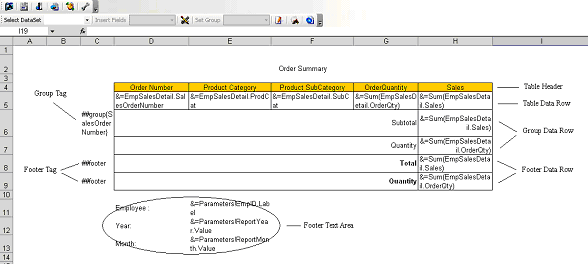
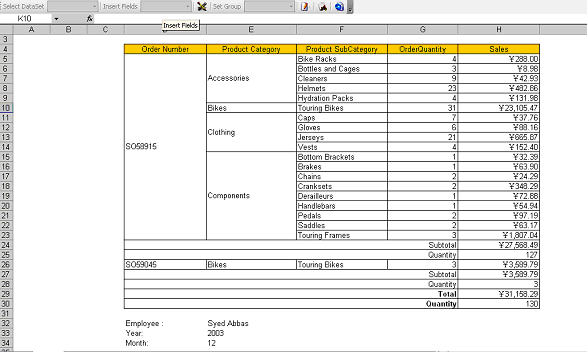

{} 

A table in an Aspose.Cells Report template consists of a header, table data rows, row groups and footers. A sample table is shown below.

**An example table** 

#### **Table Header**
Table header normally contains the title for each table column and other text items such as static text, report parameters, global report variables and so on. The table header is optional. If using a header, the header tag should be placed to the left of the first column of table data to indicate that the row is a header.
#### **Table Data Row**
A table data row is a row of cells that contain smart markers. A table can only contain a single data row.
#### **Row Group**
The row group follows closely after the table data row and comprises two parts: group tag and group data row. 

The group tag should be placed to the left of the first table data column to indicate that the row is the row group's data row. The format of the group tag is ##group{GroupColumn}, for example ##group{SalesOrderNumber} where SalesOrderNumber is one of the data set' column names. A table can only contain one row group, but a row group can contain more than one group data row. The group tag may be placed only in the first data row, as shown in the sample above.

The group tag is removed from the output Microsoft Excel file at rendering time. Row groups are optional.
#### **Footers**
Footers come after the row group and includes three parts: footer tag, footer data row and footer text area. 

The footer tag should be placed on the left of the first column of the table data column that indicates the row is the table footer. A table can contain more than one footer data rows and each footer row has to be marked by a footer tag. 

The footer text area can contain static text, report parameters and global report variables, as shown in the sample above.

The footer tag is removed from output Microsoft Excel file at rendering time. Footers are optional.

The output of the sample template is shown below.

**Sample template** 

{} 
###### **This section includes the following topics:** 
- [Preparing for Creating Table Report](/cells/reportingservices/preparing-for-creating-table-report/)
- [Adding base information for Table](/cells/reportingservices/adding-base-information-for-table/)
- [Adding Reporting Services Formulas](/cells/reportingservices/adding-reporting-services-formulas/)
- [Adding Table Group](/cells/reportingservices/adding-table-group/)
- [Adding Table Footers](/cells/reportingservices/adding-table-footers/)
- [Adding Report Parameters to Report](/cells/reportingservices/adding-report-parameters-to-report/)
- [Adding Reporting Services Global Variables to Report](/cells/reportingservices/adding-reporting-services-global-variables-to-report/)
- [Setting Report Attributes](/cells/reportingservices/setting-report-attributes/)
- [Modifying Report Attributes](/cells/reportingservices/modifying-report-attributes/)
