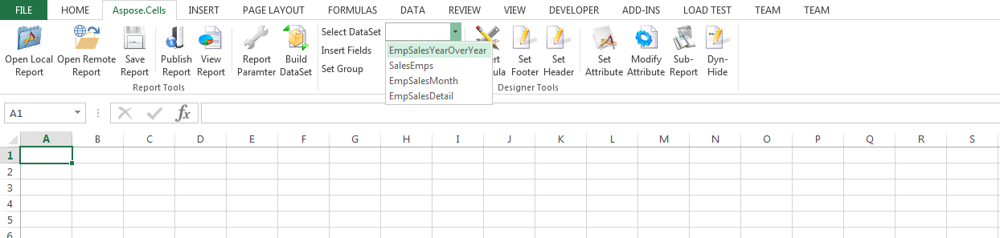
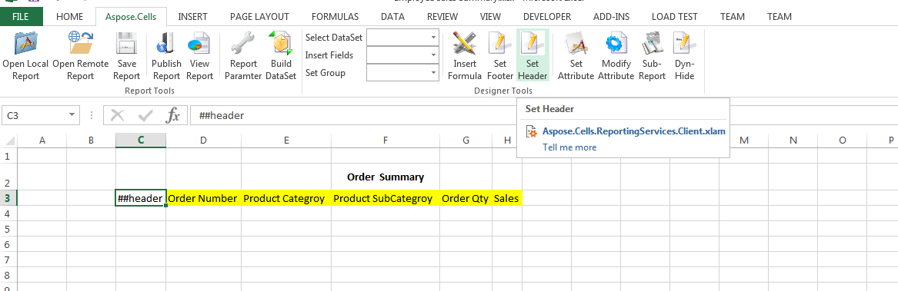
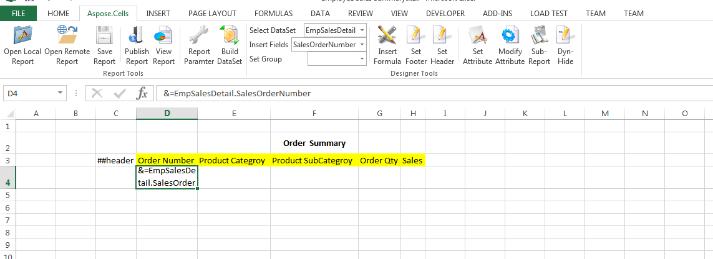

To create a new table:

1. Open Microsoft Excel.  
2. Click **Open Report** on the Aspose.Cells.Report.Designer toolbar to open an RDL Report file that contains the data sources, datasets, and Report Parameters created in advance. Once the file has been opened successfully, all its information is available for use; for example, its datasets are listed in the relevant DataSet combo box. 

   

3. Open a Microsoft Excel spreadsheet and design the table header as follows: 

   **Designing the table header** 

   

4. Select a dataset “EmpSalesDetail” from the relevant dataset combo box control. 

   **Selecting a data set** 

   

5. All the fields of dataset “EmpSalesDetail” are listed in the fields combo box. Select the cell under the OrderNumber column and then select the “SalesOrderNumber” field from the fields combo box to insert a data marker into the cell. 

   **Inserting a field** 

   

**The field code shows where a field has been inserted.** 

6. Repeat step 5 to insert the ProdCat and SubCat fields. 

   **All fields inserted** 

   
