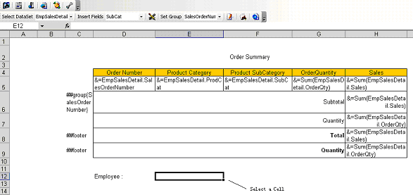
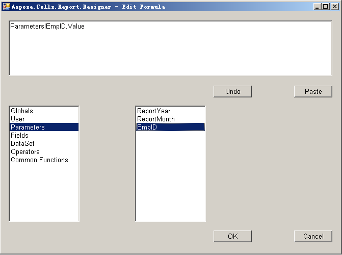
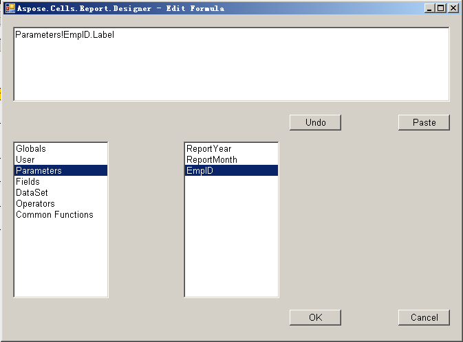
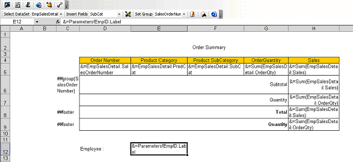

{} 

Aspose.Cells' report template supports Reporting Services report parameters as a data source for cells that contain a Reporting Services parameter marker. Please refer to [Aspose.Cells Template and Smart Markers](/cells/reportingservices/aspose-cells-template-and-smart-markers/) to learn about Reporting Services parameter markers. Report parameters are normally placed in the text area of a table header or footer.

{} 
### **Adding a Report Parameter**
To add report parameters to reports:

1. Select a cell. 

   **Selecting a cell** 

2. Click **Insert Formula** on the Aspose.Cells.Report.Designer toolbar.

   

3. Select **Parameters** from the Parameters panel on the left. All the parameters are listed in the right panel. 
4. Select a parameter; in this example, we've selected **EmpID**.
5. Double‑click the parameter to make the expression appear in the editor at the top of the form. A parameter has two data attributes: **Label** and **Value** (the default attribute is **Value**). 

   **Selecting a parameter** 

6. In the sample, the parameter's label should be shown in the report, so modify the expression to `Parameters!EmpID.Label`. 

   **Modifying the parameter** 

7. Click **OK**.  
   The selected cell contains a report parameter marker. 

   **A report parameter inserted into the cell** 

