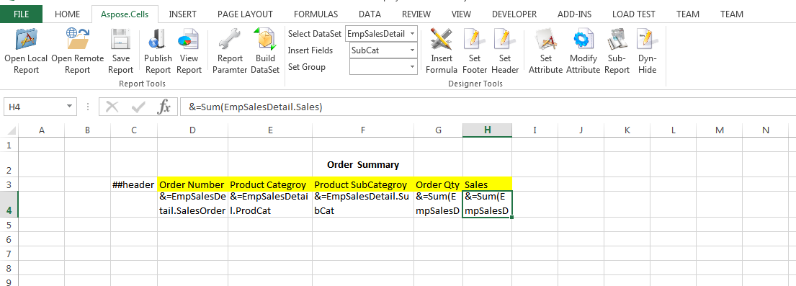

To add Reporting Services formulas to a table data cell, follow the steps below:

- Select the table data cell and click **Insert Formula** on the Aspose.Cells.Report.Designer toolbar.

  

  

- Select **DataSet** in the left panel, choose **EmpSalesDetail** in the middle panel, and double‑click **Sum(EmpSalesDetail.OrderQty)** in the right panel. A formula expression appears in the top edit box. Click the **OK** button to insert the expression into the cell.

  

- The result will be shown as follows.

**The inserted expression**

- Repeat the above steps to add a formula to the **Sales** column, as shown below.

**Formula added to the Sales column**

