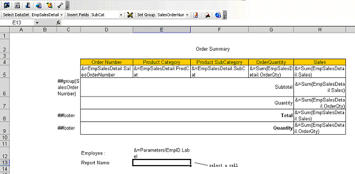

{} 

Aspose.Cells' report template supports Reporting Services' global variables as a data source for cells that contain a Reporting Services global variables marker. 

[Aspose.Cells Template and Smart Markers](/cells/reportingservices/aspose-cells-template-and-smart-markers/) explains how Reporting Services Global Variables markers work. Global variables are normally placed in the text area of a table header or footer.

{} 

To add global variables to reports:

1. Select a cell. 

   **A selected cell** 

1. Click **Insert formula** on the Aspose.Cells.Report.Designer toolbar (

).

1. Select **Globals** in the left panel.
   All global variables are listed to the right. 
1. Select **ReportName** and double-click.
   The expression appears in the **Edit** box at the top. 

   **Selecting a global variable** 

1. Click **OK** to finish.
   The cell now contains a global variable marker. 

   **A global variables marker in a cell** 

