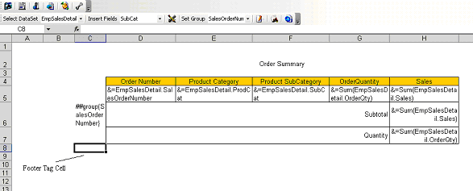
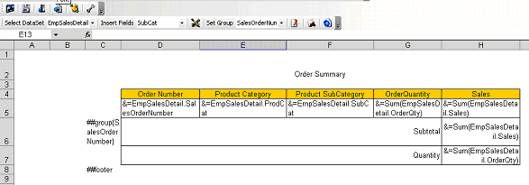
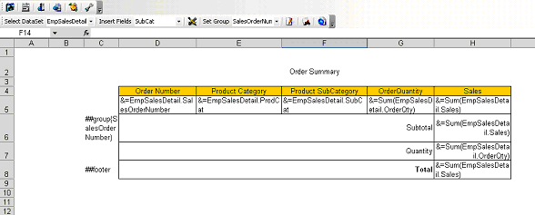
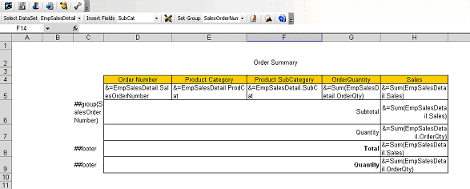

To add table footers:

1. Select the footer tag cell, directly on the left of the first column of the table, but under the table group data row (or table data row if the table does not contain a table group): 

   **Selecting the footer tag cell** 

1. Click **Set Footer** on the Aspose.Cells.Report.Designer toolbar (

). 

**The footer tag set** 

1. Add the footer data row.
   Footer data rows can contain static text, data markers, Reporting Services formulas and so on. Here, we've added a footer row that contains a merged static text cell and a Reporting Services formula cell. 

   **The completed footer** 

More than one footer data row is allowed in a table.

**A second footer row** 

