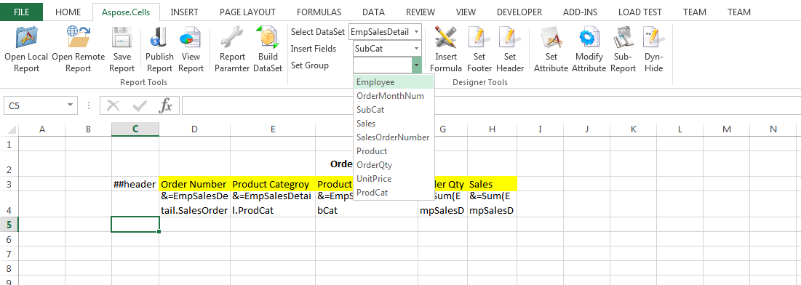
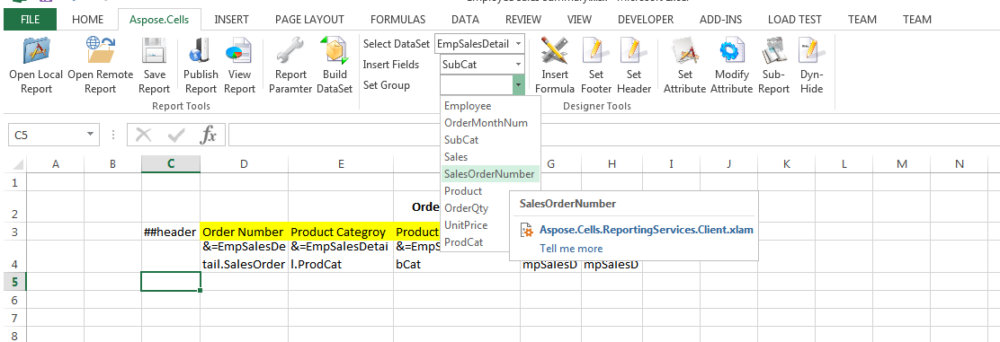
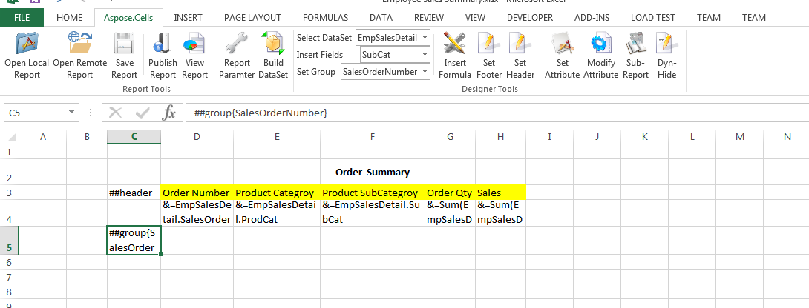
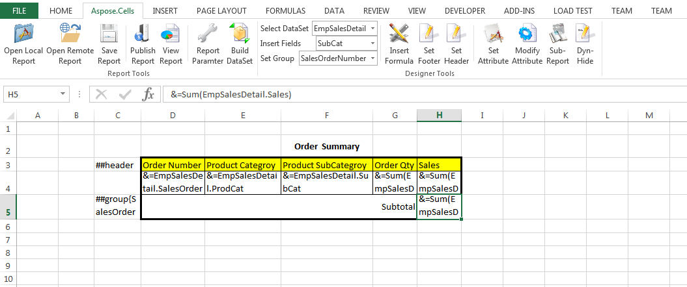
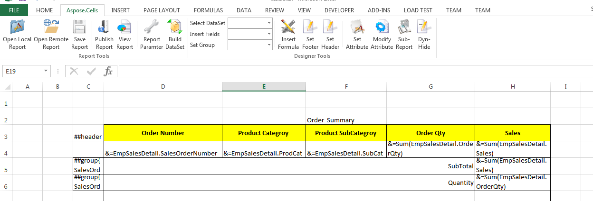

To add a table group, follow the steps below:

1)    Select the group‑tag cell that is to the left of the first column of the table data, under the table data row, as shown below.

2)    Select “SalesOrderNumber” in the **Set Group** combo box to set the group field.

The result is shown below.

3)    Add the group data row according to the instructions described above. Group data rows may contain static text, data markers, Reporting Services formulas, and so on. In the sample, we add a group row that contains a merged static‑text cell and a Reporting Services formula cell, as shown below.

4)    More than one group data row is allowed in a table. You can add another group data row, as shown below.

