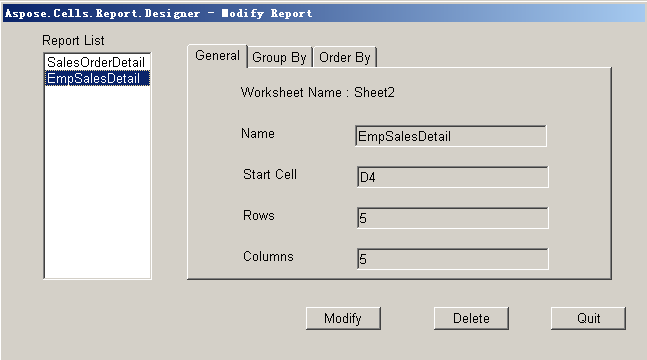
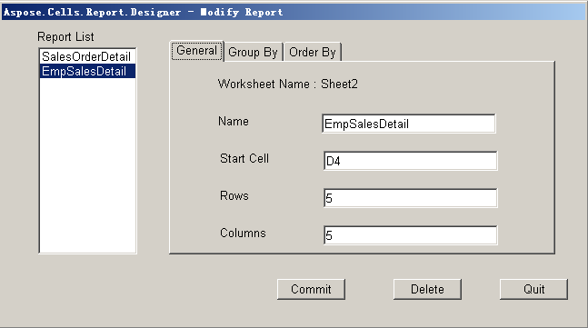

To modify the attributes of a report:

1. Click **Modify Attribute** on the Aspose.Cells.Report.Designer toolbar (see image below):

   

   Available reports are listed in the left panel.

2. Select a report and click **Modify**.

   **Selecting a report**

   

3. Modify the report attributes.

   **Modifying the attributes**

   

4. Click **Commit** to finish.
