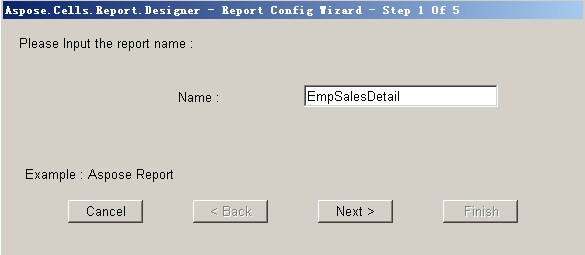
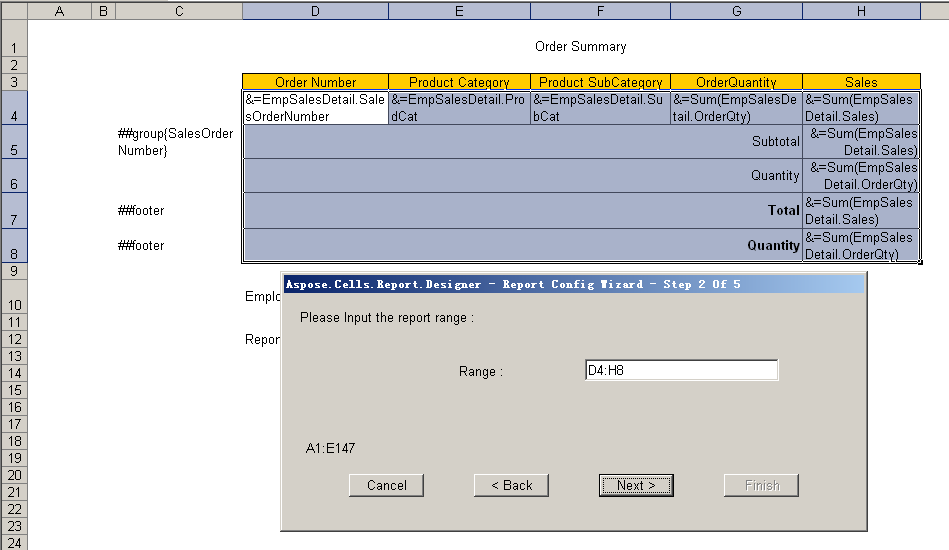
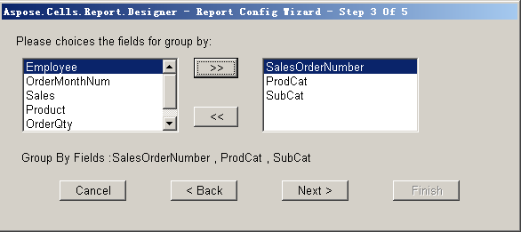
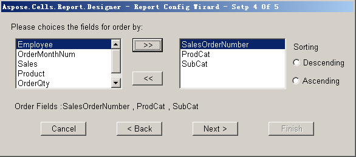
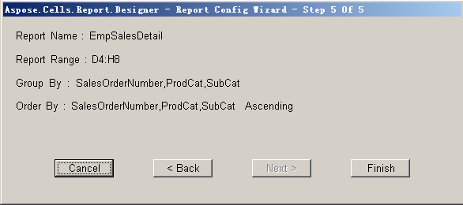

{} 

To create a table report, you need to set report attributes before publishing the report to the Report Server. The report attributes holds information about the report's name, range, data grouping, sorting and so on.

{} 

To set up the attributes of a table report:

1. Click **Set Attribute** on the Aspose.Cells.Report.Designer toolbar (

).

1. Enter the report name into the dialog box. 

   **Setting the report name** 

1. Click **Next**.
1. Select a range for the report.
   The range starts with the first cell in the table data row and ends at the last cell of the footer row, or, if there are no footers, the last cell of the group data.
   The start and end cells' index appears in the **Range** field automatically. Here, the range includes cells from D4 to H8. 

   **Defining the report range** 

1. Click **Next** to continue.
   All the fields of the dataset are listed in the left panel in the dialog box. 
1. Select fields to group the data by. 

   **Selecting fields for grouping data** 

1. Click **Next** to continue.
1. Select fields to order the data by. 

   **Selecting fields to order data by** 

1. Click **Next**.

   A summary of the report is displayed.
   **Report summary** 

1. Click **Finish**.
