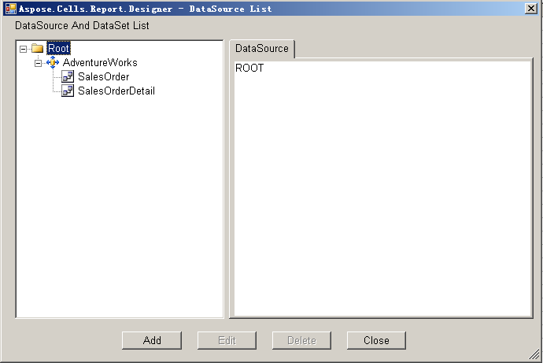
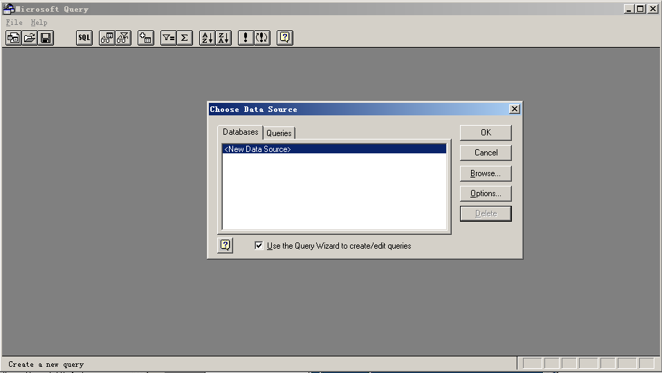
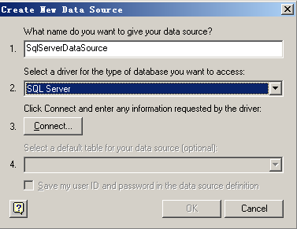
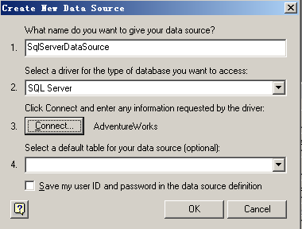
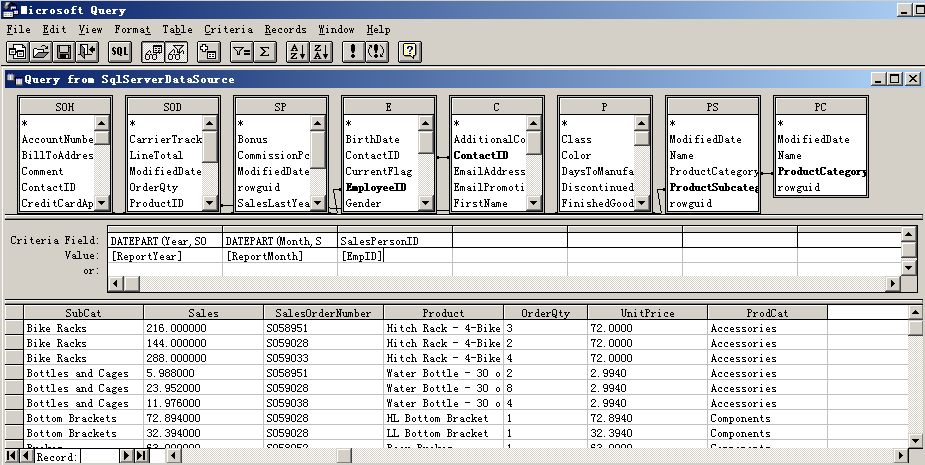
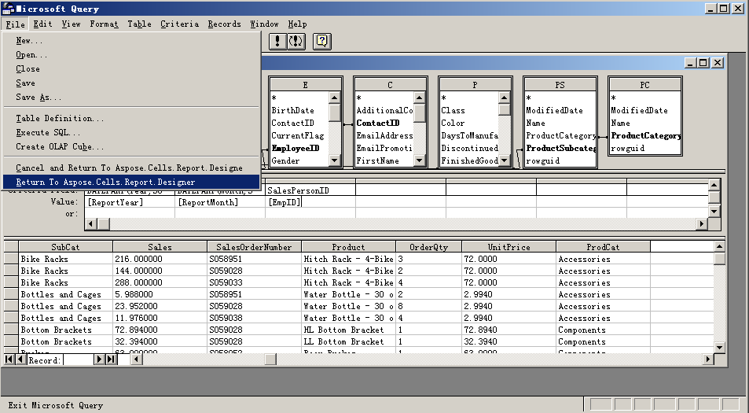
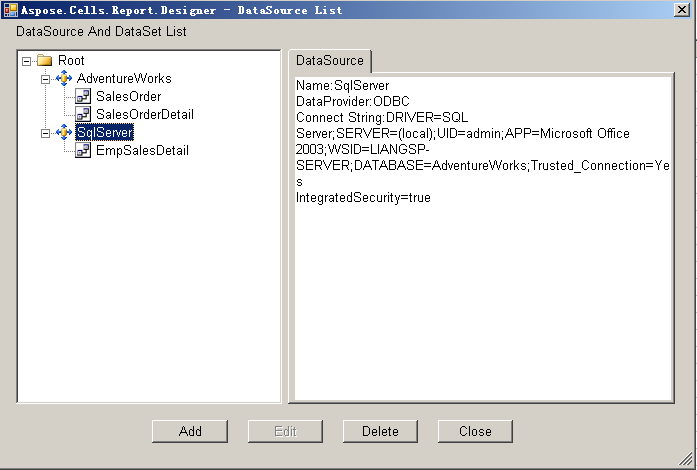
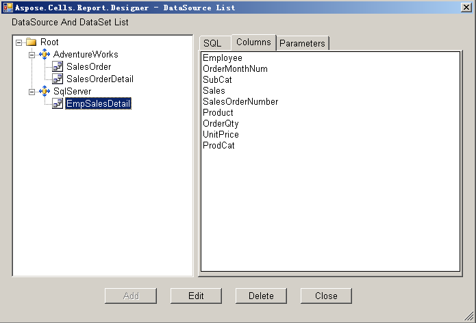

{} 

Aspose.Cells.Report.Designer integrates with MS Query and uses MS Query as a tool for creating data sources and queries. To create a new data source and query in Aspose.Cells.Report.Designer, follow the steps below:. 

{} 

To create a new data source and query in Aspose.Cells.Report.Designer:

1. Open Microsoft Excel.
1. Click **Build DataSet** in the Aspose.Cells.Report.Designer toolbar: 

All the data sources and queries are listed in the dialog box. 

1. A data source node: 

1. A data set node: 

1. Select the tree's root node.
1. Click **Add**. 

   **Adding data sources and data sets** 

1. In the dialog box, call the data source **SqlServer** and the data set **EmpsSalesDetail**.
1. Click **Next**. 

   **Adding data sets and data sources** 

Aspose.Cells.Report.Designer starts Microsoft Query. 

1. In the Choose Data Source dialog, select **New Data Source**.
1. Click **OK**.
   You may also select a existing data source. 

   **Choosing a data source** 

1. Input a data source name and select SQL Server from the drop-down list of database drivers.
1. Click **Connect**. 

   **Creating a new data source** 

1. In the SQL Server Login dialog, select the appropriate value for each item.
   For example, set server to local, select the AdventureWorks database and select **Use Trusted Connection**.
1. Click **OK**. 

   **Logging in to the SQL server** 

1. Click **OK**. 

   **Note that we are now logged in to the SQL server** 

The new data source appears in the **Choose Data Source** dialog. 

1. Select the new data source. 

   **The new data source** 

1. Click **OK** to open Microsoft Query.
1. To create a query in Microsoft Query, refer to the Microsoft Query Helper. In the following sample, we create a query with parameters. 

   **Building a query** 

The SQL is as follows: 

**SQL**



 SELECT C.FirstName + ' ' + C.LastName AS Employee,

DATEPART(Month, SOH.OrderDate) AS OrderMonthNum,

PS.Name AS SubCat,

SUM(SOD.LineTotal) AS Sales,

SOH.SalesOrderNumber,

P.Name AS Product,

SUM(SOD.OrderQty) AS OrderQty,

SOD.UnitPrice,

PC.Name AS ProdCat

FROM  Sales.SalesOrderHeader SOH ,

Sales.SalesOrderDetail SOD ,

Sales.SalesPerson SP,

HumanResources.Employee E,

Person.Contact C,

Production.Product P,

Production.ProductSubcategory PS ,

Production.ProductCategory PC

where SOH.SalesOrderID = SOD.SalesOrderID

and SOH.SalesPersonID = SP.SalesPersonID

and SP.SalesPersonID = E.EmployeeID

and E.ContactID = C.ContactID

and SOD.ProductID = P.ProductID

and P.ProductSubcategoryID = PS.ProductSubcategoryID

and PS.ProductCategoryID = PC.ProductCategoryID

and  (DATEPART(Year, SOH.OrderDate) =  ?)

AND (DATEPART(Month, SOH.OrderDate) =  ?)

AND (SOH.SalesPersonID =?)

GROUP BY    C.FirstName + ' ' + C.LastName,

DATEPART(Month, SOH.OrderDate), SOH.SalesOrderNumber,

P.Name, PS.Name, SOD.UnitPrice, PC.Name



The query has three parameters: ReportYear, ReportMonth and EmpID.

1. From Microsoft Query's **File** menu, select **Return To Aspose.Cells.Report.Designer**. 

   **Returning to the report designer** 

The data source and query created above are listed in the dialog box. 

1. Click the data source **SqlServer** to view its detailed information. 

   **The new data source** 

1. Click the query EmpSalesDetails to view its detailed information. 

   **Click SQL Tab to view the sql for the query** 

**Click Columns Tab to view the columns of the query** 

**Click Parameters Tab to view the parameters of the query** 

