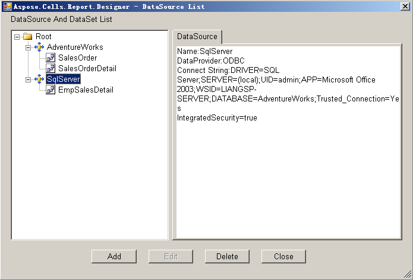
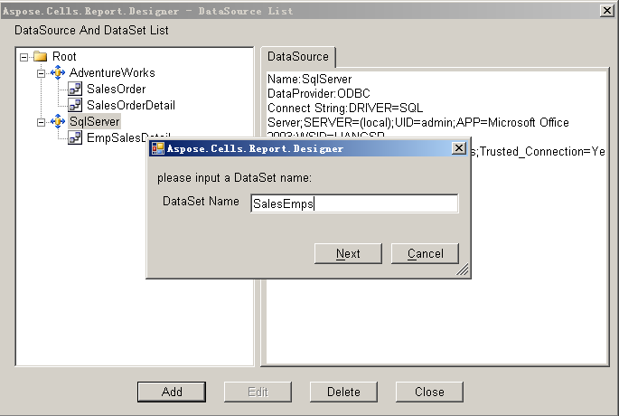
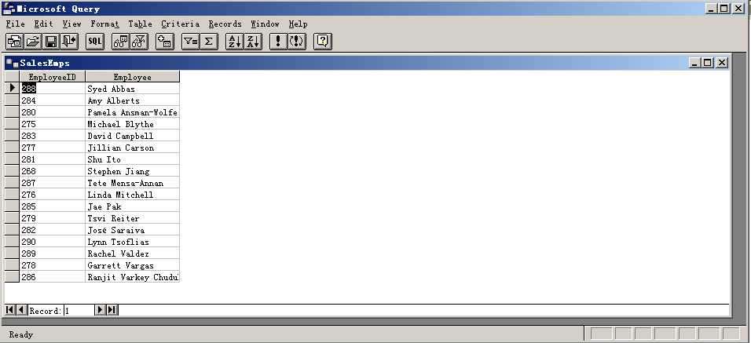
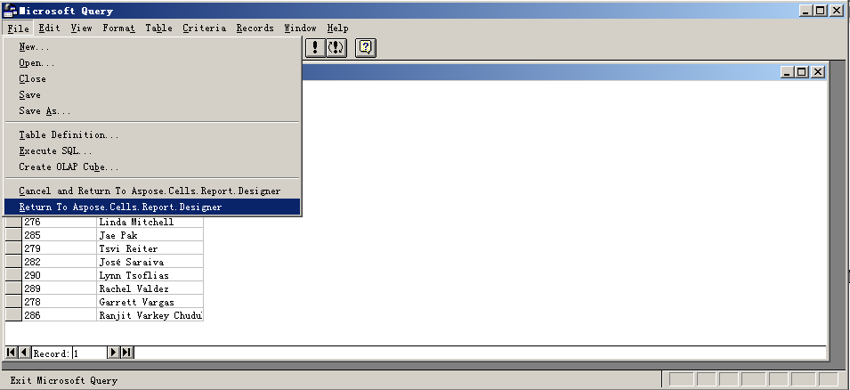
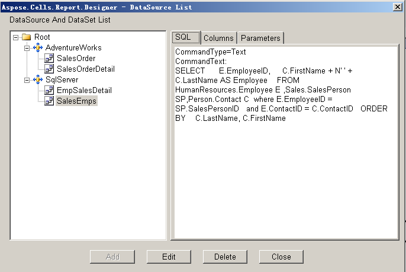

To create a new query using an existing data source:

1. Open Microsoft Excel.  
2. Click **Build DataSet** in the Aspose.Cells.Report.Designer.  

   

3. In the dialog box, select one of the data sources listed in the left panel. For example, **SqlServer**.  
4. Click **Add**.  

   **Selecting a data source**  

   

5. In the dialog box, type a new data set name, for example, **SalesEmps**.  
6. Click **Next**.  

   **Naming a new data set**  

   

Aspose.Cells.Report.Designer starts Microsoft Query and connects to the selected data source. A new query can now be created with Microsoft Query.  

**Building a new query**  

7. From Microsoft Query's **File** menu, select **Return To Aspose.Cells.Report.Designer**.  

   **Return to the Report Designer**  

   

The data source **SqlServer** contains two datasets, one of which is the new dataset **SalesEmps**.  

**The new data set**  

