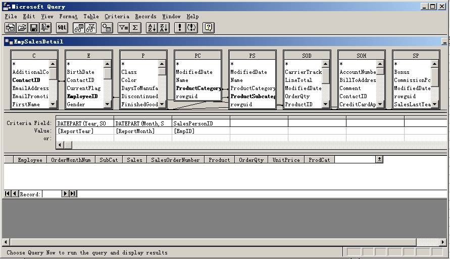

To edit a query in Aspose.Cells.Report.Designer:

1. Open Microsoft Excel.  
2. Click **Build DataSet** on the Aspose.Cells.Report.Designer toolbar.

   

3. In the dialog box, select a data set, for example, **EmpSalesDetail**.  
4. Click **Edit**.

   **Selecting a data set**

   

5. Aspose.Cells.Report.Designer starts Microsoft Query and opens the query for editing.

   **Editing a query in Microsoft Query**

   

6. From Microsoft Query's **File** menu, select **Return to Aspose.Cells.Report.Designer**.

   **Return to the Report Designer**

   
