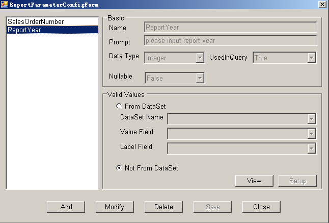
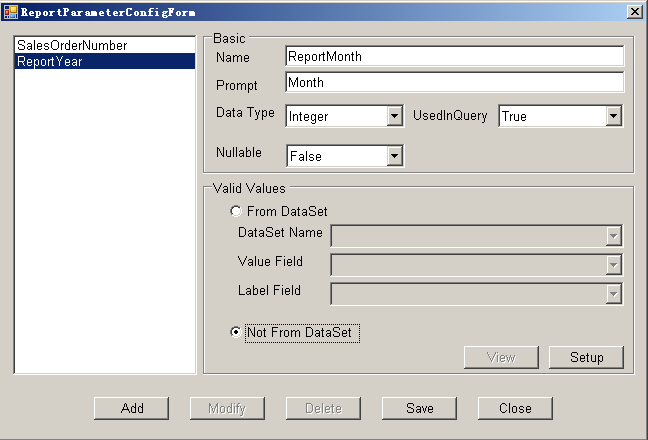
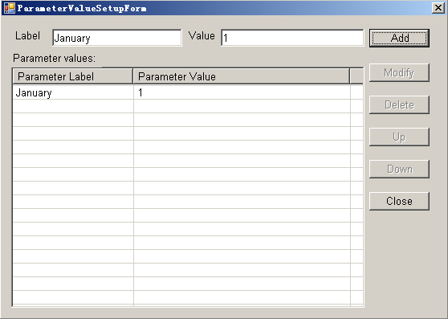
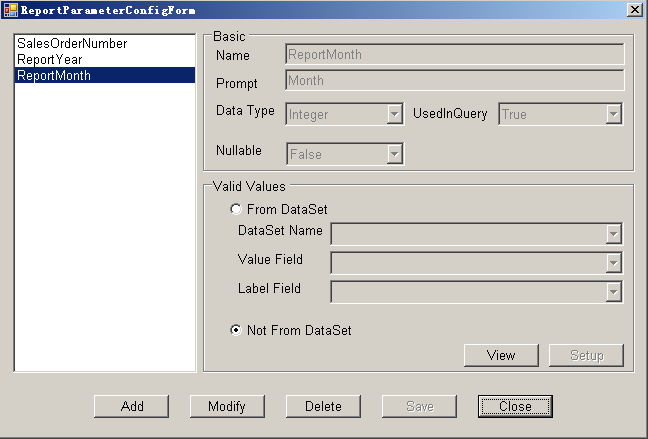

To create a report parameter in Aspose.Cells.Report.Designer:

1. Open Microsoft Excel.
1. Click **Report Parameter** on the Aspose.Cells.Report.Designer toolbar. (

)
In the dialog box, all the report parameters are listed in the left panel. 

1. Click **Add**. 

   **The Report Parameter Configuration form** 

1. In the dialog box, input the report parameter information. 

   **Adding parameter information** 

The valid values for a report parameter may come from a dataset or a group of user-defined values. A report parameter has two data fields: label and value. The label value can be null. 

1. Click **Setup** to set up a group of values for the report parameter.
1. Add values for the **Label** and **Value** fields. 

   **Adding label and value** 

1. Click **Add**.
   Repeat to add other values for the parameter.
1. Click **Close**.
1. Click **Save** to save the parameter. 
1. The new report parameter is listed in the left panel. 

   **The new parameter** 

