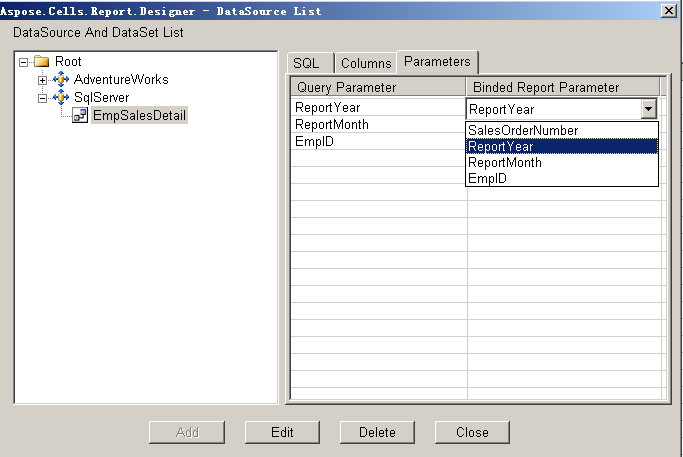

1. Open Microsoft Excel.  
2. Click **Build Data Set** on the Aspose.Cells.Report.Designer toolbar (  

   

   ).  

3. Select a data set in the left panel, for example **EmpSalesDetail**.  

   **Selecting a data set**  

   

4. Click the **Parameters** tab in the right panel to list the data set's parameters.  
5. Click the **Bound Report Parameter** column. All the report parameters that were created in advance are listed.  
6. Select a parameter.  

   **Mapping parameters**  

   

7. Repeat to map all the query parameters to report parameters.  

   **Mapping complete**  

   

8. Click **Close**.
