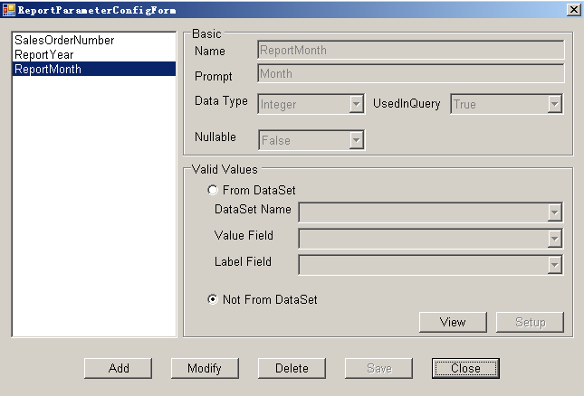
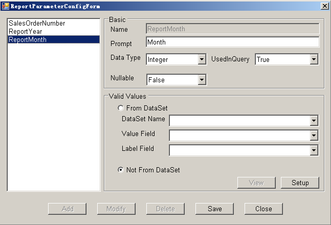

To modify a report parameter: 

1. Open Microsoft Excel.
1. Click **Report Parameter** on the Aspose.Cells.Report.Designer toolbar (

).

1. Select a report parameter listed in the left panel, for example **ReportMonth**.
1. Click **Modify**. 

   **Selecting a parameter** 

1. Modify the report parameter information. 

   **Modifying the parameter** 

1. Click **Save**.
