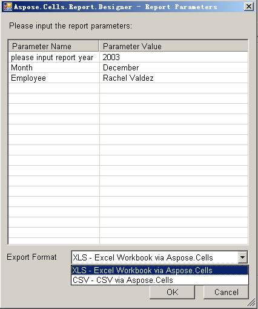

{} 

Previewing a report helps you ensure that it is the report you want.

{} 

To preview a report:

1. Click **View** on the Aspose.Cells.Report.Designer toolbar.

   

2. Enter the URL of the Report Server and click the **Refresh** button.

   

3. Select a report and click the **Preview** button.

   

4. In the dialog box, enter the report parameters and select the export file format. Click the **OK** button to export the report.

   
