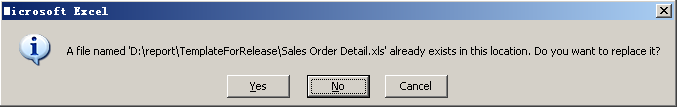
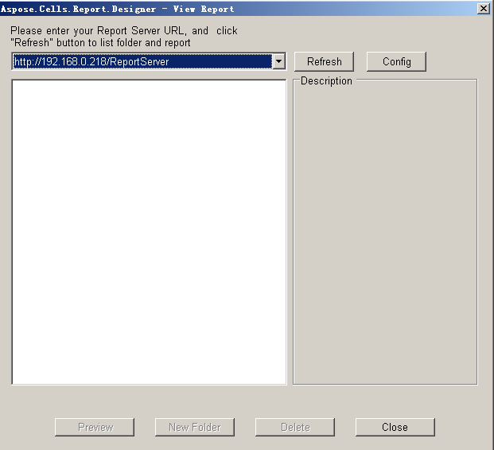

{} 

When you have designed a report with all the elements you want it to have, the next step is to publish it to the Reporting Server so that you and your colleagues can run it.

{} 

To publish a report to Report Server, follow the steps below:

1. Click **Publish**  

   

   on the Aspose.Cells.Report.Designer toolbar, and click the **Yes** button to save the report.  

   

2. In the dialog box, enter the URL of the Report Server and click the **Refresh** button.  

   

3. Select a target folder and enter the report name. Click the **DataSource Setup** button to set up data sources.  

   

   The DataSource Setup dialog is displayed.

4. In the dialog box, enter the data source information. Click **Select** to choose the shared data sources. (If you require them, the shared data sources should be the report's primary data source). Click the **OK** button to complete the work.  

   

5. Click **Publish** to publish the report to Report Server.  

   
