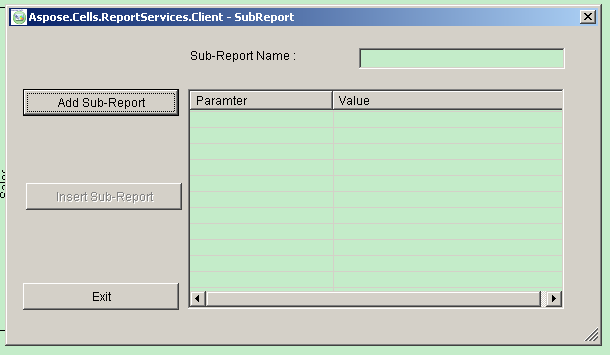
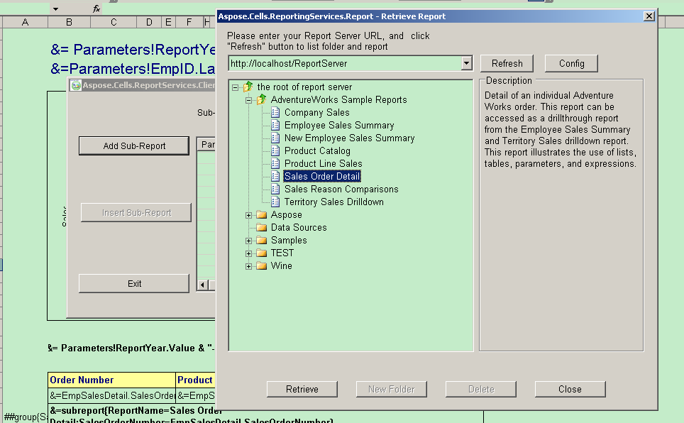
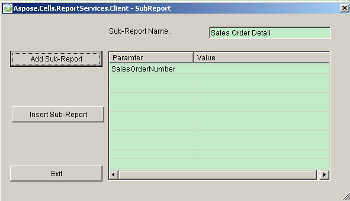
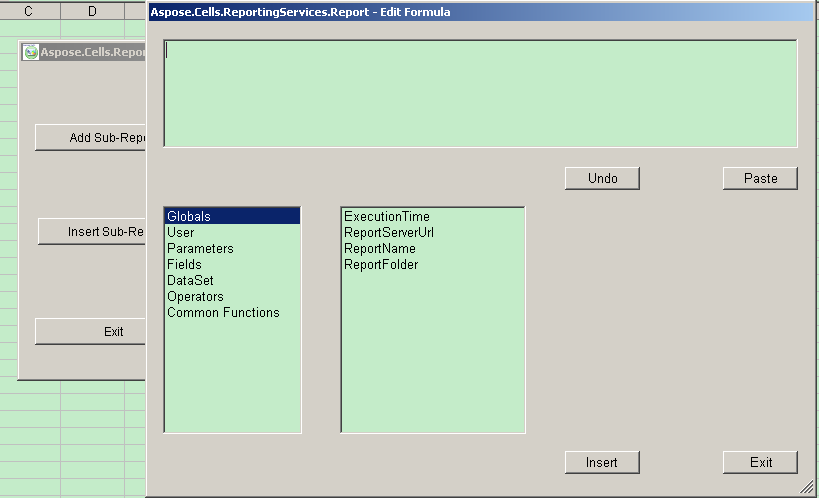

To add a sub‑report item:

1. Select the cell that will reference the sub‑report item.  
1. Click **Sub‑Report**.

The sub‑report form is shown.  

**The Sub‑Report form**  

1. Click **Add Sub‑Report**.  
   The Retrieve Report form is displayed.  
1. Select a report.  

   **Selecting a report**  

   

1. Click **Close**.  

   **A sub‑report has been selected**  

   

1. Double‑click the parameter list to show the Edit Formula dialog.  

   **The Edit Formula dialog**  

   

1. Edit and/or update a parameter value.  

   **Naming the sub‑report**  

   

1. Click **Insert Sub‑Report**.  

   **The sub‑report inserted into a report table.**  

   
