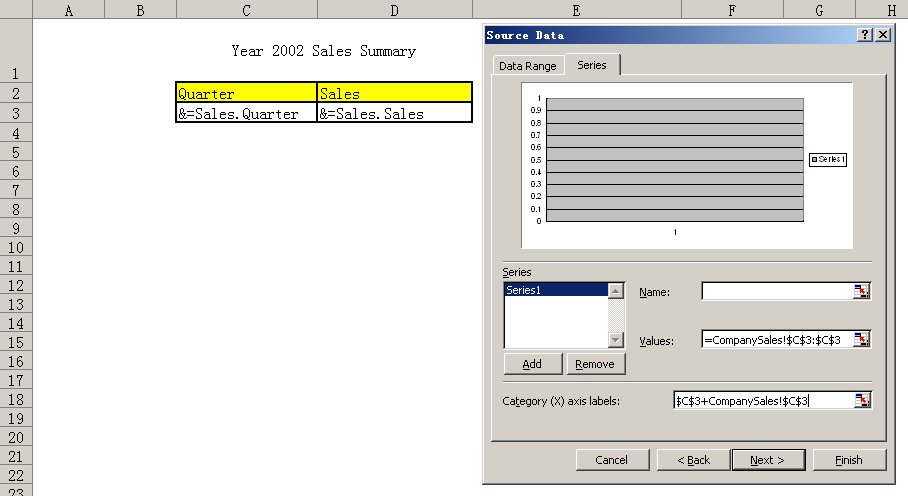

{} 

Aspose.Cells Report template supports Microsoft Excel charts. Each time you execute a report, the chart is populated with the most recent data. 

{} 

To add a chart to a report template:

1. First, create the dataset that will be the data source for the chart.  
   Below, we use the AdventureWorks sample database that ships with SQL Server Reporting Services 2005 and create a dataset named **Sales**.  
   This SQL defines the dataset: 

**SQL**



 SELECT DATEPART(yy,SOH.OrderDate) 'Year',

'Q'+DATENAME(qq,SOH.OrderDate) 'Quarter',

SUM(SOD.UnitPrice*SOD.OrderQty) 'Sales'

FROM AdventureWorks.Sales.SalesOrderDetail SOD,

AdventureWorks.Sales.SalesOrderHeader SOH

WHERE SOH.SalesOrderID = SOD.SalesOrderID

AND ((DATEPART(yy,SOH.OrderDate)=2002))

GROUP BY DATEPART(yy,SOH.OrderDate), 'Q'+DATENAME(qq,SOH.OrderDate)



Please refer to [Data Sources and Queries](/cells/reportingservices/data-sources-and-queries/) to learn more about how to create a data source and dataset in **Aspose.Cells.Report.Designer**.

1. Create a tabular report according to the instructions in [Creating Tabular Report](/cells/reportingservices/creating-tabular-report/). The report we&#39;ve created for this example is below. The table is the chart&#39;s data source. 

2. In Microsoft Excel, click the **Insert** menu and select **Chart**.  
3. Click **Next**.  

4. Click the **Series** tab.  

5. Click **Add**.  

6. In the dialog box, set the value of **Series1** (Quarter series) to the table’s first data field.  
   In the sample, that is “CompanySales!$C$3:$C$3”. The first **$C$3** is the first row of the “Quarter” column, and the second **$C$3** is a placeholder for the last row of “Quarter”. It will be replaced with the table data’s actual row index at rendering time. Set the category (X) axis labels to “=CompanySales!$C$3:$C$3”.  

7. Click **Add** to add another series.  
   In the sample, we&#39;ve added the sales series.  
8. Set the value of **Series2** (Sales series) to the table’s second data field.  
   In the sample it is “CompanySales!$D$3:$D$3”. The first **$D$3** is the first row of the “Sales” column, and the second **$D$3** is a placeholder for the last row of “Sales”. It will be replaced with the table data’s actual row index at rendering time.  
9. Click **Next** to continue.  

10. In the dialog box, set the chart title and the category (X) axis.  
11. Click **Finish** to complete the work.  

The template looks as shown below.  

12. Save the report and publish it to Report Server.  
13. Export the report from Report Server.  
    The result is shown below.  

