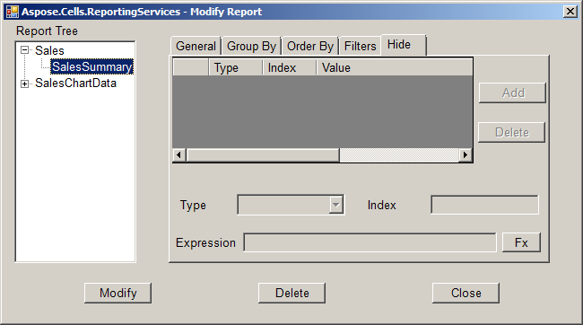
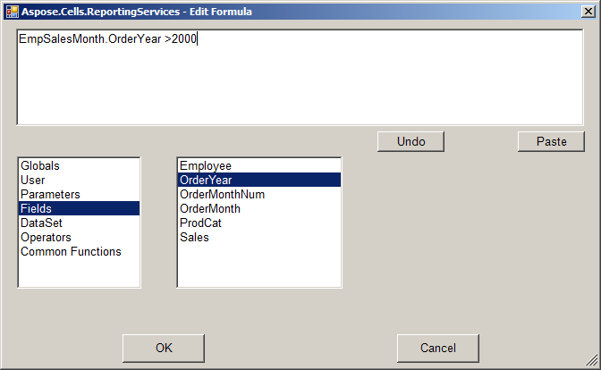
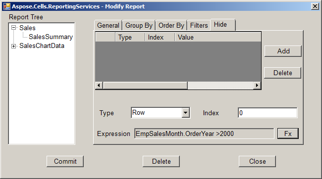
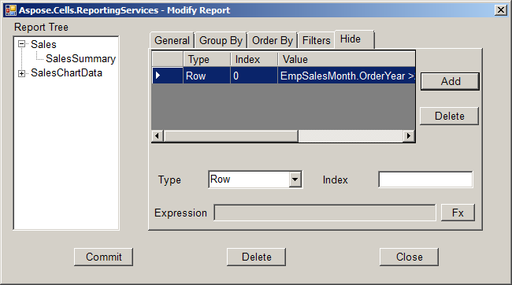
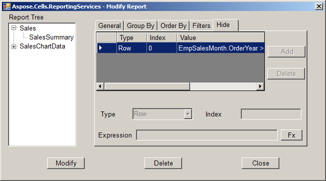

1. In Microsoft Excel, click **Modify Attribute** on the Aspose.Cells command bar.  
   The Modify Report dialog appears.  

2. Select a table report item.  

3. Click the **Hide** tab.  

   

4. Click **Modify** to make the tab editable.  

   

5. Edit the hide information.  

6. Click **Fx**.  
   The **Edit Formula** dialog is displayed.  

   

7. Edit the expression value.  

8. Click **OK** to save the formula into the Modify Report dialog.  

   

9. Edit any other hide information.  

10. Click **Add** to add the hide information.  

    

11. Click **Commit** to add the hide information into the report cache.  

12. Click **Close** to close the dialog.  

    

13. Save and publish the report.
